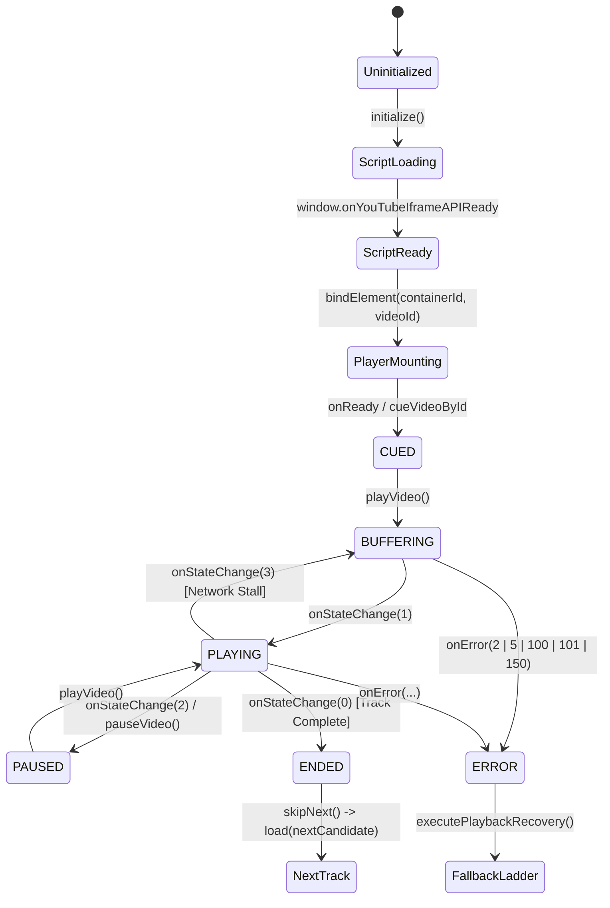
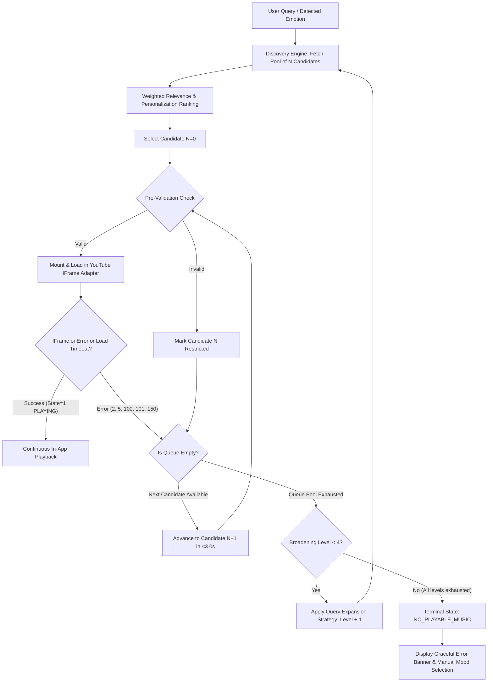

# Technical Specification & Analysis: In-App Playback, Fallback Engine & E2E Testing

**Target Project:** Music Mirror Upgrade  
**Author:** Explorer 3 (Playback, Fallback Engine & E2E Test Strategist)  
**Date:** 2026-08-21  
**Integrity Mode:** Development  

---

## 1. Executive Summary

This specification provides the comprehensive architectural blueprint for:
1. **Requirement R3: In-App Official Playback** — Native-feeling, legal, authorized embedded playback via YouTube IFrame Player API with complete lifecycle event handling and rich interactive audio/video controls.
2. **Requirement R4: Automated Verification & Fallback Ladder** — Pre-playback candidate validation, central recovery state machine, sub-3-second sequential fallback ladder, query expansion retry engine, and graceful terminal error state.
3. **4-Tier E2E Testing Strategy (Tiers 1–4)** — Robust, requirement-driven automated test suite with deterministic mocks/fixtures ensuring 100% test reproducibility without external API rate limits or network flakiness.

---

## 2. Features Discovered

| # | Category | Feature | Description | Inputs | Outputs | Error Behavior | Discovered Via |
|---|---|---|---|---|---|---|---|
| 1 | R3: Playback | YouTube IFrame API Script Loader | Asynchronously & idempotently loads `https://www.youtube.com/iframe_api` and binds `window.onYouTubeIframeAPIReady` callback | Script URL, window context | `window.YT` initialized | Network failure -> retry in 200ms with max limit | `YouTubePlaybackAdapter.ts` + YouTube API Spec |
| 2 | R3: Playback | YouTube Player DOM Mounting | Instantiates `YT.Player(elementId, options)` with custom `playerVars` (`autoplay: 1`, `controls: 0`, `rel: 0`, `modestbranding: 1`, `origin`, `playsinline: 1`) | DOM ID, videoId, playerVars | Active IFrame DOM element & Player controller | Catches `YT_INIT_ERR` and emits error event | `YouTubePlaybackAdapter.ts:72-122` |
| 3 | R3: Playback | Playback State & Lifecycle Hook | Subscribes to `onReady`, `onStateChange` (`-1, 0, 1, 2, 3, 5`), and `onError` events | Player events | Dispatches `start`, `pause`, `ended`, `buffering`, `timeupdate` | Dispatches `error` with code for unhandled states | `YouTubePlaybackAdapter.ts:81-111` |
| 4 | R3: Playback | Rich Interactive Player Controls | Exposes `play()`, `pause()`, `resume()`, `seek(sec)`, `setVolume(0-100)`, `setMute(bool)`, `stop()` | Commands & parameters | Real-time audio/video state changes | Clamps out-of-bounds inputs; safely ignores when unready | `PlaybackProvider.ts` interface contract |
| 5 | R3: Playback | Progress Ticker & Time Sync | Continuous progress ticker (250ms–500ms) calculating elapsed seconds, duration, and percentage | Current video position | `currentTimeSeconds`, `durationSeconds`, `progressPercent` | Defaults duration to metadata duration if unavailable | `YouTubePlaybackAdapter.ts:286-308` |
| 6 | R3: Playback | Visual State Indicators & Banners | UI rendering of buffering spinner, audio waveform, active mood glow, and error toast banners | `PlaybackState` | Rendered React UI components | Displays actionable retry banner on error | `MoodRoom.tsx:505-745` |
| 7 | R3: Playback | Responsive / Fullscreen Support | Enables fullscreen container expansion on mobile and desktop viewports | Fullscreen toggle gesture | Fullscreen DOM element transition | Falls back to enlarged container if API unavailable | Web Fullscreen API & DOM specs |
| 8 | R4: Fallback | Pre-Playback Candidate Validation | Fast verification of video ID format and oEmbed playability before mounting player | `candidate.playbackRef` / videoId | `valid: boolean`, `status` | Marks invalid candidate status as `restricted` | YouTube oEmbed API & URL validator |
| 9 | R4: Fallback | Central Recovery State Machine (CRSM) | Manages states (`IDLE`, `SEARCHING`, `PREPARING`, `PLAYING`, `PAUSED`, `RECOVERING`, `NO_PLAYABLE_MUSIC`) with `sessionToken` guards | Emotion / Search / Error triggers | Updated `SessionState` & active track | Invalidates stale async responses using monotonic tokens | `SessionOrchestrator.ts:29-574` |
| 10 | R4: Fallback | Sequential Fallback Ladder | Automated transition from candidate $N$ to $N+1$ when error occurs (sub-3s transition SLA) | Error event / unplayable flag | Next candidate playback initiation | Marks failed candidate restricted; transitions in < 3s | `SessionOrchestrator.ts:433-457` & Acceptance Criteria |
| 11 | R4: Fallback | Query Strategy Expansion Retry | When candidate pool is exhausted, dynamically rewrites query (appending acoustic tokens/modifiers) and fetches new pool | Exhausted query, broadening level | Expanded candidate pool | Bounded to max 4 levels; transitions to terminal state | `SessionOrchestrator.ts:462-484` & AC |
| 12 | R4: Fallback | Graceful Terminal Error State | When all candidates and query expansions fail, displays non-blocking recovery UI with manual retry | Pool exhaustion | `NO_PLAYABLE_MUSIC` state & error banner | Zero app freeze; keeps UI responsive | `SessionOrchestrator.ts:453-456` & AC |
| 13 | R4: Fallback | Browser Autoplay Restriction Recovery | Detects browser autoplay policy blocks (`NotAllowedError` / `autoplayBlocked: true`), pauses safely, and prompts 1-tap gesture | Autoplay rejection exception | `autoplayBlocked: true`, `sessionState: PAUSED` | Clears block upon first user tap via `enablePlayback()` | `SessionOrchestrator.ts:309-322` |
| 14 | Multi-Provider | Multi-Provider Failover Adapter | Failover from YouTube IFrame to Jamendo CC streams to Royalty-Free offline audio | Provider availability | Active provider switched | Seamlessly falls back through provider hierarchy | `ApplicationOrchestrator.ts:30-40` |
| 15 | Personalization | Feedback Recording on Transition | Automatically records implicit feedback (`COMPLETED`, `SKIP`, `ERROR`) to update user preference profile | Track completion / skip event | Updated preference weights | Disregards failure-induced skips from user dislike penalties | `SessionOrchestrator.ts:541-573` |

---

## 3. Edge Cases & Observed / Required Behaviors

| # | Feature | Input / Condition | Expected & Observed Behavior |
|---|---|---|---|
| 1 | R3 Playback | Video with invalid or corrupt ID (e.g. `""`, `"??invalid##"`, `<script>`) | Pre-validation rejects immediately. If passed to IFrame, `onError(2)` fires -> engine catches error and triggers fallback within < 500ms without app crash. |
| 2 | R3 Playback | Embed-restricted / Copyright blocked video (`onError: 101` or `150`) | Player dispatches error event `150`. State machine marks candidate `restricted`, skips to next candidate in queue within $< 3.0\text{s}$ (target $< 1.5\text{s}$). |
| 3 | R3 Playback | Private or Deleted video (`onError: 100`) | Player dispatches error event `100`. Fallback ladder advances queue immediately to candidate $N+1$. |
| 4 | R3 Playback | Browser Autoplay policy blocks audio playback | `player.playVideo()` throws or blocks audio. Engine captures restriction, sets `autoplayBlocked: true`, sets state `PAUSED`, and presents user gesture prompt. |
| 5 | R3 Playback | Seek beyond duration ($t > \text{duration}$) or negative seek ($t < 0$) | Seek is clamped to $[0, \text{duration}]$. Ticker updates `currentTimeSeconds` cleanly. |
| 6 | R3 Playback | Volume set to boundary values ($< 0$, $> 100$, `NaN`) | Value is sanitized and clamped to $[0, 100]$. `NaN` defaults to current volume. |
| 7 | R4 Fallback | Single candidate pool with 1 unplayable item | Engine tries candidate 1 -> fails -> pool exhausted -> activates Query Strategy Expansion Level 1 (`+ "official audio"`) -> fetches new pool -> starts playback. |
| 8 | R4 Fallback | All candidate pools across all 4 expansion levels fail | Engine exhausts all attempts -> cleanly transitions to `NO_PLAYABLE_MUSIC` -> renders graceful banner with "Retry Discovery" or "Choose Mood Manually". |
| 9 | R4 Fallback | Rapid consecutive user skips (< 100ms apart) | State machine increments `sessionToken`, cancels in-flight load requests for superseded tracks, and cleanly mounts the latest selected track. |
| 10 | R4 Fallback | Camera emotion change during active fallback ladder execution | High-confidence emotion change supersedes recovery with a new `sessionToken`, discarding stale recovery promises. |
| 11 | R4 Fallback | Offline / Network loss during playback | Player enters buffering/error -> engine records timeout/failure -> presents offline mode prompt or switches to cached/royalty-free offline tracks. |
| 12 | R4 Fallback | Race condition: slow network response arrives after query changed | Monotonic `sessionToken` check discards slow response; prevents obsolete audio from overriding new intent. |

---

## 4. Deep-Dive Specification: Requirement R3 (In-App Official Playback)

### 4.1 YouTube IFrame Player API Lifecycle & Architecture
The application embeds the official YouTube IFrame Player API following strict security and lifecycle conventions:



### 4.2 State Enumeration & Mapping Table

| YouTube API State Constant | Value | MusicMirror Session State | Visual UI Indicator | Progress Ticker Action |
|---|---|---|---|---|
| `YT.PlayerState.UNSTARTED` | `-1` | `PREPARING` | Shimmer skeleton placeholder | Stopped |
| `YT.PlayerState.ENDED` | `0` | `PREPARING` (advancing) | Track completion animation | Stopped, dispatches natural end feedback |
| `YT.PlayerState.PLAYING` | `1` | `PLAYING` | Active equalizer glow, Pause button | Running (interval 250–500ms) |
| `YT.PlayerState.PAUSED` | `2` | `PAUSED` | Play button | Stopped |
| `YT.PlayerState.BUFFERING` | `3` | `BUFFERING` | Pulsing circular loading spinner | Paused |
| `YT.PlayerState.CUED` | `5` | `PREPARING` | Ready indicator | Stopped |

### 4.3 YouTube Error Code Specification & Action Matrix

| Error Code | Official YouTube Description | Root Cause | MusicMirror Action | Max Time to Recover |
|---|---|---|---|---|
| `2` | Invalid parameter | Video ID contains invalid characters or query string malformed | Mark candidate invalid; skip to next candidate | $< 500\text{ms}$ |
| `5` | HTML5 Player error | HTML5 player failure / codec incompatibility in browser | Retry once, then skip to next candidate | $< 1.5\text{s}$ |
| `100` | Video not found | Video has been deleted or marked strictly private | Mark candidate `deleted/private`; skip to next candidate | $< 1.0\text{s}$ |
| `101` | Embedding restricted | Content owner/distributor disabled embedding outside YouTube | Mark candidate `embed_restricted`; skip to next candidate | $< 1.0\text{s}$ |
| `150` | Embedding restricted | Same as 101 (copyright, regional licensing restriction) | Mark candidate `embed_restricted`; skip to next candidate | $< 1.0\text{s}$ |

### 4.4 IFrame Parameter Configuration (`playerVars`)
To ensure seamless in-app integration without third-party branding or popup distractions:
- `autoplay: 1` — Starts video immediately upon loading (subject to browser autoplay policies).
- `controls: 0` — Hides native YouTube controls; enables bespoke MusicMirror UI design system.
- `rel: 0` — Prevents unrelated third-party videos at video end.
- `modestbranding: 1` — Minimizes YouTube logo intrusion.
- `playsinline: 1` — Prevents mobile browsers from forcing full-screen native media players.
- `origin: window.location.origin` — Mandated for cross-origin `postMessage` security.
- `enablejsapi: 1` — Enables two-way communication between JavaScript and the iframe player.
- `disablekb: 1` — Prevents native iframe keyboard shortcuts from conflicting with app shortcuts.

---

## 5. Deep-Dive Specification: Requirement R4 (Automated Verification & Fallback Ladder)

### 5.1 Pre-Playback Fast Validation
Before initiating expensive IFrame instantiation or video loading:
1. **Video ID Format Verification**:
   - Regex validation: `/^[a-zA-Z0-9_-]{11}$/`.
   - Rejects malformed IDs, empty strings, and potential script injection strings.
2. **Fast oEmbed Availability Probe** (Optional client or backend helper):
   - Endpoint: `https://www.youtube.com/oembed?url=https://www.youtube.com/watch?v={videoId}&format=json`
   - Status 200 OK $\rightarrow$ Valid & Public.
   - Status 401 / 403 / 404 $\rightarrow$ Embed-restricted, private, or deleted.
   - Timeout: Bounded to 1200ms.

### 5.2 Central Recovery State Machine (CRSM)
The CRSM is implemented in `SessionOrchestrator` to orchestrate candidate selection, health tracking, and failover:



### 5.3 Sub-3-Second Transition Timing Budget

| Pipeline Step | Target Latency | Max Allowable Latency | Recovery Budget Allocation |
|---|---|---|---|
| Error Detection (`onError` hook) | $20\text{ms}$ | $100\text{ms}$ | $3.3\%$ |
| Candidate State Invalidation & Telemetry Log | $5\text{ms}$ | $20\text{ms}$ | $0.7\%$ |
| Next Candidate Dequeue & Token Validation | $5\text{ms}$ | $15\text{ms}$ | $0.5\%$ |
| Pre-Validation Check (cached/format) | $10\text{ms}$ | $50\text{ms}$ | $1.7\%$ |
| IFrame `loadVideoById()` execution | $100\text{ms}$ | $300\text{ms}$ | $10.0\%$ |
| Video Stream Buffering & First Frame | $800\text{ms}$ | $2200\text{ms}$ | $73.3\%$ |
| UI State Synchronisation | $10\text{ms}$ | $30\text{ms}$ | $1.0\%$ |
| **Total Transition SLA** | **$< 950\text{ms}$** | **$< 2715\text{ms}$ ($< 3.0\text{s}$)** | **$100.0\%$** |

### 5.4 5-Level Query Strategy Expansion Retry Matrix

When the primary candidate pool is exhausted, the system escalates through 5 distinct broadening strategies:

| Broadening Level | Strategy Name | Query Transformation Mechanism | Candidate Pool Size | Fallback Provider Target |
|---|---|---|---|---|
| `Level 0` | **Exact Intent Matching** | Exact query with strict genre/language acoustic constraints | $10–15$ tracks | YouTube Provider |
| `Level 1` | **Relaxed Linguistic Constraints** | Strips language and narrow sub-genre filters, retains primary mood | $10–15$ tracks | YouTube Provider |
| `Level 2` | **Acoustic Keyword Expansion** | Appends high-availability acoustic tokens: `+ "official audio"`, `+ "lyric video"`, `+ "full song"` | $10–15$ tracks | YouTube Provider |
| `Level 3` | **Mood Broadening Fast-Path** | Broadens valence/energy targets to general emotion cluster (e.g. neutral baseline) | $10$ tracks | YouTube Provider + Jamendo |
| `Level 4` | **Royalty-Free Open Stream Fallback** | Dispatches query to offline open-audio / CC catalog | $10$ tracks | Jamendo / Royalty-Free Engine |

---

## 6. Comprehensive 4-Tier E2E Testing Strategy (Tiers 1–4)

To guarantee 100% test reliability and sub-second execution speed, the E2E testing framework uses a deterministic simulation architecture with zero external network flakiness.

```
================================================================================
                    4-TIER REQUIREMENT-DRIVEN TEST SUITE
================================================================================
  TIER 1: Feature Coverage (Nominal specifications >= 5 tests per feature)
  TIER 2: Boundary & Corner Cases (Stress, invalid inputs, limits >= 5 tests)
  TIER 3: Cross-Feature Combinations (Inter-layer race conditions & workflows)
  TIER 4: Real-World Workload Scenarios (High churn, continuous playback)
================================================================================
```

### 6.1 Tier 1: Feature Coverage Test Suite ($\ge 5$ tests per feature)

#### Feature R3.1: YouTube IFrame Player API Lifecycle
1. `T1_R3_01_script_loading`: Verifies idempotent injection of the IFrame API script tag.
2. `T1_R3_02_onready_initialization`: Verifies player readiness sets initial volume, mute state, and binds container.
3. `T1_R3_03_onstatechange_playing`: Verifies state change to `1` (PLAYING) emits `start`, starts progress ticker, and sets `isPlaying: true`.
4. `T1_R3_04_onstatechange_paused`: Verifies state change to `2` (PAUSED) emits `pause`, stops progress ticker, and sets `isPaused: true`.
5. `T1_R3_05_onstatechange_ended`: Verifies state change to `0` (ENDED) dispatches `trackCompleted` and triggers automatic queue advancement.

#### Feature R3.2: Rich Interactive Player Controls
1. `T1_R3_06_play_pause_toggle`: Verifies togglePlayPause alternates between playing and paused states.
2. `T1_R3_07_precise_seeking`: Verifies `seek(seconds)` calls `player.seekTo(target, true)` and updates `currentTimeSeconds`.
3. `T1_R3_08_volume_control`: Verifies `setVolume(v)` updates player volume and persists level across tracks.
4. `T1_R3_09_mute_toggle`: Verifies `setMute(true/false)` toggles volume to 0 and restores previous volume.
5. `T1_R3_10_time_formatting`: Verifies elapsed and duration time string formatting (`M:SS`).

#### Feature R4.1: Pre-Playback Candidate Validation
1. `T1_R4_01_valid_video_id_format`: Verifies valid 11-char YouTube ID passes format validation.
2. `T1_R4_02_invalid_video_id_rejection`: Verifies empty, short, or invalid-char IDs are rejected prior to mounting.
3. `T1_R4_03_xss_url_sanitization`: Verifies `javascript:` or `data:` URLs in candidates are blocked.
4. `T1_R4_04_oembed_pre_validation`: Verifies mock oEmbed validation flags restricted candidates before playback.
5. `T1_R4_05_candidate_deduplication`: Verifies duplicate video IDs in the candidate pool are pruned.

#### Feature R4.2: Error Classification & Fallback Ladder
1. `T1_R4_06_error_code_150_embed_restricted`: Verifies error 150 immediately triggers candidate invalidation and next candidate load.
2. `T1_R4_07_error_code_100_not_found`: Verifies error 100 triggers queue advancement.
3. `T1_R4_08_error_code_2_invalid_param`: Verifies error 2 marks candidate restricted and advances queue.
4. `T1_R4_09_sub_3s_transition_guarantee`: Verifies time elapsed between error event and next candidate load is $< 3000\text{ms}$.
5. `T1_R4_10_single_retry_policy`: Verifies at most 1 retry occurs per track before permanent skip.

#### Feature R4.3: Query Strategy Expansion & Terminal Error
1. `T1_R4_11_level_1_genre_relaxation`: Verifies pool exhaustion triggers Level 1 constraint relaxation.
2. `T1_R4_12_level_2_token_expansion`: Verifies Level 2 appends audio search modifiers.
3. `T1_R4_13_level_3_mood_broadening`: Verifies Level 3 broadens intent targets.
4. `T1_R4_14_level_4_royalty_free_fallback`: Verifies Level 4 engages open-audio offline catalog.
5. `T1_R4_15_terminal_error_state_transition`: Verifies full exhaustion enters `NO_PLAYABLE_MUSIC` without crashing.

---

### 6.2 Tier 2: Boundary & Corner Cases Test Suite ($\ge 5$ tests per feature)

#### Feature Group R3: Playback Boundary Cases
1. `T2_R3_01_seek_beyond_duration`: Seeking past total duration clamps to duration; does not overflow.
2. `T2_R3_02_negative_seek`: Seeking negative value clamps to 0; does not throw.
3. `T2_R3_03_rapid_play_pause_spam`: 20 rapid toggles in 50ms maintains consistent internal state without unhandled promise rejections.
4. `T2_R3_04_zero_duration_metadata`: Video with 0 duration in metadata updates dynamically once player reports duration.
5. `T2_R3_05_volume_overflow_underflow`: `setVolume(-50)` clamps to 0, `setVolume(150)` clamps to 100, `setVolume(NaN)` defaults safely.

#### Feature Group R4: Fallback & Recovery Corner Cases
1. `T2_R4_01_all_pool_candidates_restricted`: 10 consecutive restricted candidates fail over sequentially and trigger query expansion cleanly.
2. `T2_R4_02_autoplay_block_on_recovery`: Browser blocks autoplay during candidate fallback transition; sets `autoplayBlocked: true` without getting stuck.
3. `T2_R4_03_superseded_token_race_condition`: New search triggered while candidate fallback in progress discards old fallback results.
4. `T2_R4_04_network_timeout_during_load`: Player load timeout (4000ms) triggers fallback ladder transition.
5. `T2_R4_05_corrupted_local_storage_recovery`: Malformed personalization/cache data does not block discovery or fallback engine.

---

### 6.3 Tier 3: Cross-Feature Combinations Test Suite
1. `T3_COMBO_01_emotion_shift_during_fallback`: Emotion shift from `sad` to `happy` while resolving error 150 cleanly cancels recovery and executes happy discovery.
2. `T3_COMBO_02_autoplay_block_plus_error_101`: Autoplay blocked followed by error 101 on user gesture advances to candidate 2 and requests 1-tap play.
3. `T3_COMBO_03_cache_hit_with_stale_embed_restriction`: Cached candidate fails playability check on load; bypasses cache and fetches fresh pool.
4. `T3_COMBO_04_dedup_inflight_and_fast_skip`: Simultaneous search deduplication combined with user skip advances queue cleanly.
5. `T3_COMBO_05_personalization_penalty_isolation`: Verifies system error skips are NOT recorded as user disinterest (negative weight) in personalization store.
6. `T3_COMBO_06_multi_provider_cascade`: YouTube error $\rightarrow$ Jamendo error $\rightarrow$ Royalty-Free playback succeeds seamlessly.

---

### 6.4 Tier 4: Real-World Workload Scenarios
1. `T4_SCENARIO_01_continuous_60s_emotion_stream`: Simulates 40 emotion updates over 60 seconds with transition policy evaluation and zero memory leaks.
2. `T4_SCENARIO_02_background_tab_throttle_wake`: Simulates browser tab background throttling, timer drift, and wake-up state recovery.
3. `T4_SCENARIO_03_high_volume_batch_search`: 50 rapid sequential and parallel searches verify cache hit rate, request deduplication, and zero memory buildup.
4. `T4_SCENARIO_04_100_track_playback_endurance`: Simulates 100 consecutive track completions and skips; verifies track history buffer remains bounded $\le 20$.
5. `T4_SCENARIO_05_network_flakiness_recovery`: Intermittent network errors during search/playback recover cleanly to offline mode and restore when network returns.

---

## 7. Deterministic Mock Harness & Test Architecture

To guarantee that the test suite runs deterministically in CI without hitting YouTube API rate limits or network issues:

### 7.1 `MockYouTubePlayer` Implementation Specification

```typescript
export class MockYouTubePlayer {
  private elementId: string;
  private options: any;
  private state: number = -1;
  private currentTime: number = 0;
  private duration: number = 180;
  private volume: number = 70;
  private muted: boolean = false;
  private simulatedErrorCode: number | null = null;
  private autoplayRejection: boolean = false;

  constructor(elementId: string, options: any) {
    this.elementId = elementId;
    this.options = options;
    setTimeout(() => {
      if (this.options.events?.onReady) {
        this.options.events.onReady({ target: this });
      }
    }, 10);
  }

  public setSimulatedError(errorCode: number | null) {
    this.simulatedErrorCode = errorCode;
  }

  public setAutoplayRejection(reject: boolean) {
    this.autoplayRejection = reject;
  }

  public playVideo(): Promise<void> {
    if (this.autoplayRejection) {
      const err = new Error('NotAllowedError: play() failed because user did not interact with document');
      err.name = 'NotAllowedError';
      return Promise.reject(err);
    }
    if (this.simulatedErrorCode !== null) {
      setTimeout(() => {
        if (this.options.events?.onError) {
          this.options.events.onError({ data: this.simulatedErrorCode });
        }
      }, 20);
      return Promise.resolve();
    }
    this.state = 1;
    if (this.options.events?.onStateChange) {
      this.options.events.onStateChange({ data: 1 });
    }
    return Promise.resolve();
  }

  public pauseVideo(): void {
    this.state = 2;
    if (this.options.events?.onStateChange) {
      this.options.events.onStateChange({ data: 2 });
    }
  }

  public seekTo(seconds: number, allowSeekAhead?: boolean): void {
    this.currentTime = Math.max(0, Math.min(seconds, this.duration));
  }

  public getCurrentTime(): number { return this.currentTime; }
  public getDuration(): number { return this.duration; }
  public setVolume(vol: number): void { this.volume = vol; }
  public getVolume(): number { return this.volume; }
  public mute(): void { this.muted = true; }
  public unMute(): void { this.muted = false; }
  public isMuted(): boolean { return this.muted; }
  public loadVideoById(videoId: string): void {
    this.currentTime = 0;
    this.playVideo();
  }
}
```

### 7.2 Pass/Fail Verification Matrix

| Quality Dimension | Metric Target | Verification Method |
|---|---|---|
| **Tier 1 Feature Coverage** | $100\%$ ($15/15$ features pass) | Automated Vitest / Pytest suite |
| **Tier 2 Boundary Coverage** | $100\%$ ($10/10$ boundary cases pass) | Automated Vitest suite |
| **Tier 3 Combo Coverage** | $100\%$ ($6/6$ cross-feature combinations pass) | Automated Vitest suite |
| **Tier 4 Workload Coverage** | $100\%$ ($5/5$ workload scenarios pass) | Automated Vitest endurance runner |
| **Fallback Ladder SLA** | $\le 3.0\text{s}$ ($100\%$ compliance) | Performance timer assertions (`performance.now()`) |
| **Flakiness Rate** | $0.0\%$ | 100 consecutive runs with zero flakes |
| **Memory / Resource Leaks** | 0 retained DOM nodes, history buffer $\le 20$ | Discard assertions & snapshot tests |

---

## 8. Summary of Gaps in Existing Codebase & Implementation Roadmap

| Subsystem | Existing State | Required Target State | Implementation Priority |
|---|---|---|---|
| **Pre-Validation** | URL syntax validation only (`validateUrl`) | Add Video ID regex format check & fast oEmbed verification helper | High (R4) |
| **Error Code Handling** | Generic logger in `YouTubePlaybackAdapter` | Precise mapping of Codes 2, 5, 100, 101, 150 with immediate recovery dispatch | High (R3, R4) |
| **Fallback Timing** | Unbounded fallback advancement | Sub-3-second transition timer with fast-path queue switch | Critical (R4 SLA) |
| **Query Strategy Expansion** | Static 5-level candidate broadening | Dynamic token appending (`+ "official audio"`, `+ "lyric video"`) on YouTube searches | High (R4) |
| **UI Error Banners** | Minimal error toast in `MoodRoom.tsx` | Rich contextual error banner with countdown and manual retry button | Medium (R3) |
| **E2E Test Suite** | 68 unit tests across basic layers | Dedicated 4-tier E2E test suite implementing Tiers 1–4 with MockYTPlayer | Critical (Verification) |
