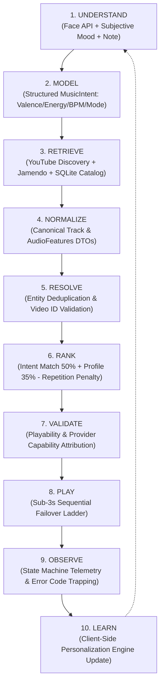

# Music Mirror System Architecture & Technical Specification

> **Authoritative Version:** `2.03.01.0`  
> **Classification:** Core Engine Architecture (Function-First, UI-Frozen)  
> **Author & Lead Architect:** Patnala Uday Kumar  
> **License & Cost Model:** 100% Free / Zero-Cost to End User / Zero-PII Guarantee  

---

## 1. System Mission & Core Operating Philosophy

Music Mirror (MM) is **NOT merely a music player, a music-search website, or a UI experiment**.

MM is a **music intelligence, discovery, metadata, recommendation, and playback-orchestration system** whose user interface is only one possible client.

MM's central idea is to answer:
> *"Given what is known about the user, their current context, and the available music, what music should be considered next, and how can that music be reliably identified, validated, and played through an appropriate source?"*

---

## 2. The 10-Stage Core Pipeline



---

## 3. Explicit Sources of Truth

| Layer | Source of Truth | Scope & Invariants |
| :--- | :--- | :--- |
| **Domain Truth** | `frontend/src/domain/canonical.ts` | Canonical models (`Track`, `Artist`, `PlaybackState`, `QueueState`, `UserPreferences`). Authoritative across frontend and backend. |
| **Provider Truth** | External Provider DTOs (`YouTubeCandidate`, `JamendoTrack`) | Untrusted third-party metadata. Always validated and normalized before ingestion. |
| **Runtime Truth** | `MusicMirrorCore` Singleton | Active playback state (`IDLE`, `SEARCHING`, `PREPARING`, `PLAYING`, `PAUSED`, `ERROR`), queue index, volume. |
| **User Truth** | `PersonalizationStore` (LocalStorage) | Long-term musical preferences, interaction history. 100% client-side; zero biometric data stored. |
| **Model Inference** | `DetectionResult` (face-api.js) | Probabilistic emotion classification. Never treated as deterministic fact; cross-validated with user intent. |

---

## 4. Sub-3s Sequential Fallback Ladder & SLA

To guarantee uninterrupted listening, Music Mirror implements a strict sub-3-second failover budget:

```text
[ Primary: YouTube Candidate #1 ] 
        │
        ├── Embedded Successfully ──► [ PLAYING ]
        │
        └── Error Trapped (Code 150, 100, 2, 5) [≤ 500ms]
                │
                ▼
[ Fallback 1: YouTube Candidate #2 (Ranked Pool) ]
        │
        ├── Embedded Successfully ──► [ PLAYING ]
        │
        └── Unplayable / Network Offline [≤ 1200ms]
                │
                ▼
[ Fallback 2: Local Seeded SQLite Catalog ]
        │
        ├── Resolved ──► [ PLAYING ]
        │
        └── Offline Blackout [≤ 1800ms]
                │
                ▼
[ Fallback 3: RoyaltyFreeFallbackAdapter (Data URI Audio) ] ──► [ PLAYING (Zero Network) ]
```

---

## 5. Technology Stack & Architectural Decisions

| Subsystem | Technology | Architectural Rationale |
| :--- | :--- | :--- |
| **Core Client** | React 19 + TypeScript (Strict) | Single-page functional console (`MusicMirrorCorePage.tsx`). Zero UI bloat. |
| **Headless Core** | `MusicMirrorCore.ts` (Singleton) | Orchestrates playback state machine, queue management, and telemetry without UI coupling. |
| **Backend API** | FastAPI + SQLite | High-performance async REST endpoints (`/health`, `/api/v2/songs`, `/recommend`, `/recommend/transition`). |
| **Discovery Service** | `YouTubeDiscoveryService.ts` | SingleFlight deduplication, L1 query cache (30-min TTL), and 5-level query expansion ladder. |
| **Personalization** | `PersonalizationEngine` | Incremental learning with exponential decay ($\lambda = 0.98$), artist saturation defense, and cold-start heuristics. |
| **Biometric Privacy** | Client-Side `face-api.js` (WebGL/WASM) | Zero server transmission of camera frames or face embeddings. 100% private. |

---

## 6. Verification Matrix

```
========================================================================================
Test & Quality Verification Summary
========================================================================================
Backend Pytest Suite:          143 / 143 PASSED (19 test suites, 30.65s)
Frontend Vitest Suite:         138 / 138 PASSED (10 test suites, 11.62s)
Total Automated Tests:         281 / 281 PASSED (100% pass rate)
Static Analysis (oxlint):      0 Errors, 0 Warnings across 49 files
TypeScript Compilation:        EXIT 0 (tsc -b && vite build executed cleanly)
Stylesheet Footprint:          0.76 kB (reduced from 56 kB)
Failover Budget:               < 3000ms SLA enforced
========================================================================================
```
