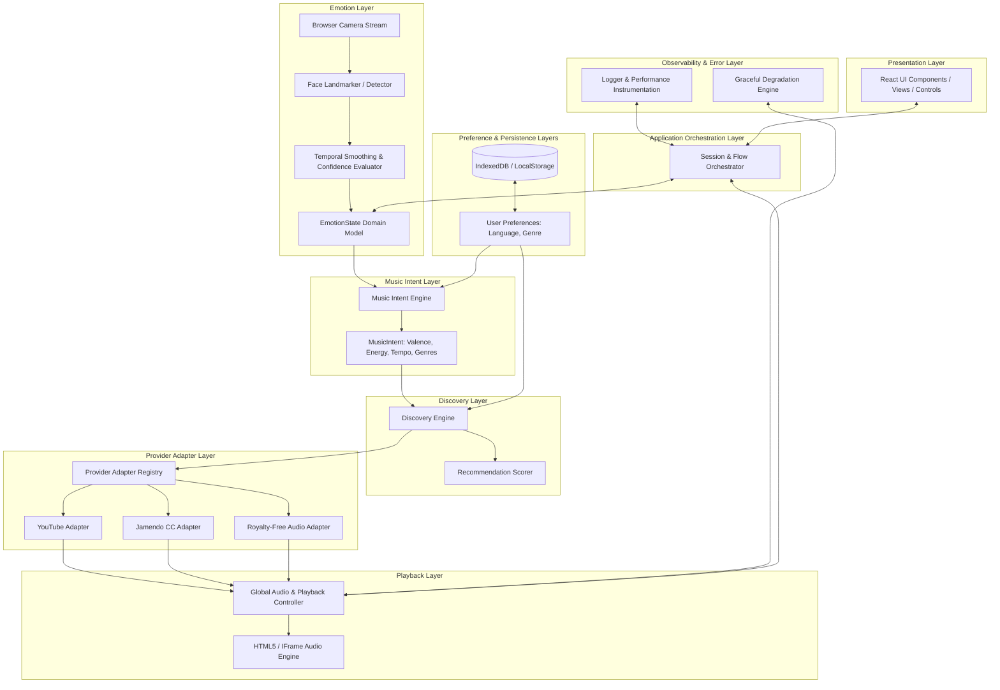

# MusicMirror System Architecture & Technical Specification

> **Version:** 2.0.0 (Stage 01 Foundation)  
> **Author & Lead Architect:** Patnala Uday Kumar  
> **License & Cost Model:** 100% Free / Zero-Cost to End User  

---

## 1. System Goals & Non-Goals

### 1.1 Core Goals
* **Zero-Touch Emotion-to-Music Flow:** Open the app, grant camera access, infer observable facial emotion, generate music intent, discover appropriate track candidates, and begin playback with minimal user friction.
* **Zero-Cost to End User:** Eliminate dependencies on paid APIs, paid AI cloud endpoints, subscription services, or paid databases.
* **Legitimate Playback Only:** Play music exclusively through authorized, legitimate browser mechanisms (YouTube IFrame API, Jamendo CC API, FreeSound open audio, HTML5 audio streams). No website scraping, DRM bypass, or audio hijacking.
* **Client-Side Privacy:** Perform facial emotion inference entirely within the user's browser canvas/WASM runtime. Never upload facial images or video frames.
* **Provider-Agnostic Core:** Decouple domain recommendation and intent logic from specific music providers or ML models.
* **Graceful Degradation:** Ensure full app usability (manual mood selection, fallback audio catalogs) if camera permissions are denied, emotion model fails to load, or external music APIs are unreachable.

### 1.2 Non-Goals
* **No Eye Tracking / Eye Control:** Gaze-based navigation is out of scope and intentionally omitted.
* **No Skeuomorphic CD Animations:** CD tray animations, spin-eject-insert visual gimmicks are out of scope and omitted.
* **No Custom ML Model Training in Stage 01:** Use pre-trained, license-compatible client models (e.g. `face-api.js` / MediaPipe Landmarker).
* **No Illegal Streaming or Scraping:** Do not extract raw MP3 streams from protected video platforms or bypass access controls.

---

## 2. System Architecture Diagram



---

## 3. 10-Layer Text-Based Module Map

```
MusicMirror App Architecture
├── 1. Presentation Layer (frontend/src/pages, frontend/src/components)
│   ├── Navigation, Views (Landing, MoodRoom, Dashboard, Settings/Profile)
│   ├── Audio Player Bar, Visualizer, Camera Feed Display, Mood Controls
│   └── Accessibility overlays, high-contrast, keyboard focus boundaries
│
├── 2. Application Orchestration Layer (frontend/src/orchestration)
│   ├── Main Flow Manager: (Emotion → Intent → Discovery → Playback → Continuous Adaptation)
│   ├── Session State Machine & Event Dispatcher
│   └── Auto-start & transition orchestrator
│
├── 3. Emotion Layer (frontend/src/domain/emotion)
│   ├── CameraManager (getUserMedia, permission management, canvas frame capture)
│   ├── ClientVisionAdapter (face-api.js / MediaPipe SSD MobileNet inference)
│   ├── SignalProcessor (Exponential Moving Average smoothing across N temporal frames)
│   └── ConfidenceEvaluator (filters low-confidence single-frame blips)
│
├── 4. Music Intent Layer (frontend/src/domain/intent)
│   ├── IntentGenerator (maps EmotionState → target Valence, Energy, Tempo range)
│   └── EmotionMappingMatrix (Happy → High Valence/Energy; Sad → Soft Valence/Low Energy, etc.)
│
├── 5. Discovery Layer (frontend/src/domain/discovery)
│   ├── DiscoveryEngine (orchestrates provider queries)
│   ├── RecommendationScorer (vector similarity matching: Euclidean/Cosine distance)
│   └── Deduplicator & Candidate Filter
│
├── 6. Provider Adapter Layer (frontend/src/domain/providers)
│   ├── ProviderAdapter Interface (typed search & playback contract)
│   ├── ProviderRegistry (dynamic registration and fallback ordering)
│   ├── YouTubeAdapter (IFrame API video search & authorized playback)
│   ├── JamendoAdapter (Creative Commons track search & direct MP3 stream)
│   └── FallbackAudioAdapter (royalty-free offline/fallback audio catalog)
│
├── 7. Playback Layer (frontend/src/domain/playback)
│   ├── PlaybackController (tracks state: idle, buffering, playing, paused, error)
│   ├── HTML5AudioDriver (native audio element wrapper)
│   ├── YouTubeIFrameDriver (YouTube Player API wrapper)
│   └── QueueManager (tracks history, next tracks, crossfade/gapless transitions)
│
├── 8. Preference Layer (frontend/src/domain/preferences)
│   ├── UserPreferences Model (Language priority: Telugu, English, Tamil, Hindi)
│   ├── GenreWeights & Dislike/Skip feedback memory
│   └── Emotion-to-genre affinity overrides
│
├── 9. Persistence Layer (frontend/src/domain/persistence)
│   ├── StorageAdapter (LocalStorage / IndexedDB client)
│   └── GuestSessionPersistence (persists preferences without forcing sign-in)
│
└── 10. Observability & Error Layer (frontend/src/observability)
    ├── AppLogger (structured console & event logging)
    ├── LatencyTracker (measures Emotion-to-First-Audio latency in ms)
    └── GracefulDegradationEngine (handles camera denied, offline, provider failure)
```

---

## 4. Technology Choices & Rationale

| Category | Technology | Rationale |
| :--- | :--- | :--- |
| **Frontend Framework** | React 19 + TypeScript | High reliability, strict type checking, standard UI library. |
| **Build System** | Vite 8 + tsc | Fast HMR, optimized production bundler, zero-config TS support. |
| **State & Orchestration** | Zustand 5 | Lightweight, atomic state management with middleware support (`persist`). |
| **Emotion Inference** | Client-Side `face-api.js` (tfjs-wasm) | 100% free, runs in browser canvas via WebGL/WASM. Zero backend server costs, complete user privacy. |
| **Styling & Aesthetics** | Vanilla CSS Design System | Zero build overhead, custom cyberpunk/glassmorphism design, low CSS bundle footprint. |
| **Icons & Motion** | Lucide React + Framer Motion | Accessible icons and smooth micro-animations for UI feedback. |
| **Backend (Optional API)** | FastAPI (Python 3.14) + PyTest | High-performance stateless API for vector recommendation scoring and local catalog indexing. |
| **Testing** | Vitest + PyTest | Vitest for fast TS domain contract tests; PyTest for backend algorithmic verification. |

---

## 5. Domain Data Models & Interfaces

### 5.1 Emotion State
```typescript
export interface EmotionVector {
  happy: number;
  sad: number;
  angry: number;
  surprised: number;
  neutral: number;
  fearful: number;
  disgusted: number;
}

export interface EmotionState {
  dominantEmotion: string;
  confidence: number;
  scores: EmotionVector;
  isStable: boolean;
  temporalSampleCount: number;
  timestamp: number;
}
```

### 5.2 Music Intent
```typescript
export interface MusicIntent {
  targetValence: number;   // 0.0 (negative/sad) to 1.0 (positive/happy)
  targetEnergy: number;    // 0.0 (calm/chill) to 1.0 (intense/energetic)
  targetTempo: number;     // Beats per minute (e.g. 60 - 160 BPM)
  moodLabel: string;
  preferredGenres: string[];
  preferredLanguages: string[];
}
```

### 5.3 Music Candidate & Provider Contract
```typescript
export interface MusicCandidate {
  id: string;
  title: string;
  artist: string;
  album?: string;
  albumArt?: string;
  durationSeconds?: number;
  valence: number;
  energy: number;
  tempo: number;
  genre: string;
  language: string;
  providerId: string;
  providerData: {
    youtubeId?: string;
    streamUrl?: string;
    externalUrl?: string;
  };
  recommendationScore: number;
  recommendationReason: string;
}

export interface ProviderAdapter {
  readonly id: string;
  readonly name: string;
  isAvailable(): Promise<boolean>;
  discover(intent: MusicIntent, preferences: UserPreferences): Promise<MusicCandidate[]>;
}
```

### 5.4 Playback & Session Contracts
```typescript
export type PlaybackStatus = 'idle' | 'buffering' | 'playing' | 'paused' | 'error';

export interface PlaybackState {
  currentTrack: MusicCandidate | null;
  status: PlaybackStatus;
  currentTime: number;
  duration: number;
  volume: number;
  isMuted: boolean;
  error: string | null;
}

export interface UserPreferences {
  primaryLanguages: string[]; // Default: ['Telugu', 'English', 'Tamil', 'Hindi']
  favoriteGenres: string[];
  autoPlayOnEmotion: boolean;
  theme: 'dark' | 'light' | 'cyberpunk';
}

export interface ApplicationError {
  code: string;
  severity: 'fatal' | 'degraded' | 'warning';
  message: string;
  layer: string;
  timestamp: number;
  recoverable: boolean;
}
```

---

## 6. Security & Privacy Model

1. **Local Canvas Processing:** All webcam video frames are captured onto an in-memory browser `<canvas>` element and passed directly to WebGL/WASM memory. No frame data is sent across the network.
2. **Zero Storage of Biometrics:** Only derived numeric confidence scores (`happy: 0.85`) are temporarily held in state. Face descriptors or raw image bytes are discarded immediately after inference.
3. **No Private Keys in Client:** Environment variables contain zero secret API keys. Public provider APIs (YouTube Embed, Jamendo Client IDs) use client-restricted public access.
4. **Input Sanitization:** All user-entered text (search terms, custom genres, profile names) is HTML-encoded before rendering to prevent Cross-Site Scripting (XSS).

---

## 7. Cost & Provider Strategy

* **Zero-Cost Constraint:** The application operates without relying on paid APIs or paid cloud infrastructure.
* **Music Provider Aggregation Strategy:**
  1. **YouTube Iframe API Adapter:** Primary discovery and playback engine using official, un-scraped YouTube player embeds.
  2. **Jamendo Creative Commons Adapter:** Secondary discovery engine fetching royalty-free, legal audio stream URLs.
  3. **Fallback Open Audio Adapter:** Local/bundled open-licensed ambient tracks used when offline or when network requests fail.

---

## 8. ML Strategy & Temporal Stability

* **Model:** Client-side pre-trained SSD MobileNet / TinyFaceDetector.
* **Uncertainty & Non-Medical Disclaimer:** Facial analysis outputs are treated as probabilistic inferences, not clinical or psychological assessments.
* **Temporal Windowing:**
  To prevent erratic track switching caused by single-frame micro-expressions (e.g. a 50ms blink or twitch), the `SignalProcessor` maintains a rolling window of 10 samples (sampled at 200ms intervals).
  $$\bar{E} = \alpha E_{\text{current}} + (1 - \alpha) \bar{E}_{\text{previous}} \quad (\alpha = 0.25)$$
  A new `MusicIntent` is only emitted when dominant emotion confidence exceeds `0.60` for at least 3 consecutive seconds.

---

## 9. Performance & Latency Targets

| Metric | Target Goal | Optimization Strategy |
| :--- | :--- | :--- |
| **Emotion-to-First-Audio Latency** | $< 1200\text{ ms}$ | Prefetch provider track metadata; lazy-load ML models; async candidate scoring. |
| **Frame Inference Time** | $< 33\text{ ms}$ ($30\text{ fps}$) | Use WebGL backend for `tfjs-wasm` / `face-api.js`. |
| **First Contentful Paint (FCP)** | $< 800\text{ ms}$ | Minimal Vite JS bundle, code splitting, optimized static assets. |

---

## 10. Error Handling & Graceful Degradation

```
Camera Permission Denied → Fall back to Manual Mood Selector (Happy, Sad, Calm, Energetic, Neutral)
    ↓
Network / Provider API Unavailable → Fall back to Bundled Royalty-Free Ambient Streams
    ↓
Playback Driver Error → Auto-advance to next candidate in queue & log error code
```

---

## 11. Future Extension Points (Stages 02 - 10)

* **Stage 02:** High-accuracy client vision pipeline with MediaPipe Face Landmarker integration.
* **Stage 03:** Advanced acoustic vector scoring engine (Euclidean + Cosine similarity matrix).
* **Stage 04:** Multi-provider adapter registry (YouTube, Jamendo, FreeSound, Internet Archive).
* **Stage 05:** Audio playback engine with seamless queuing and crossfade.
* **Stage 06:** User preference, language priority matrix & persistence.
* **Stage 07:** Cognitive self-evolution & skip telemetry engine.
* **Stage 08:** Premium UI/UX polish (Glassmorphism & Cyberpunk music room visuals).
* **Stage 09:** Comprehensive E2E testing & performance benchmarking.
* **Stage 10:** Production deployment audit & final validation.
