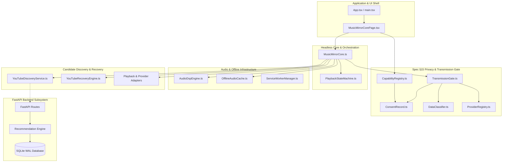

# Music Mirror — Modular Dependency Map & Ownership Graph

> **AUTHORITATIVE DEPENDENCY RELATIONSHIP GRAPH**  
> Version: `2.06.02.0`  
> Governed by: [`.agents/rules/universal_modular_architecture_and_change_isolation.md`](.agents/rules/universal_modular_architecture_and_change_isolation.md)

---

## 1. High-Level Subsystem Dependency Flow

---

## 2. Detailed Module Dependency Matrix

| Consumer Module | Direct Dependencies | Purpose of Dependency | Allowed Direction |
|---|---|---|---|
| `MusicMirrorCorePage.tsx` | `MusicMirrorCore.ts`, `CapabilityRegistry.ts`, `ConsentRecord.ts` | Reactive UI observation & user action triggers | UI Shell $\to$ Core/Permissions |
| `MusicMirrorCore.ts` | `canonical.ts`, `PlaybackStateMachine`, `AudioDspEngine`, `YouTubeDiscoveryService`, `OfflineAudioCache`, `TransmissionGate` | Headless playback orchestration & stream routing | Core $\to$ Services/Infrastructure |
| `TransmissionGate.ts` | `DataClassifier.ts`, `ProviderRegistry.ts`, `ConsentRecord.ts` | Pre-flight egress payload classification & destination check | Security Gate $\to$ Taxonomy |
| `AudioDspEngine.ts` | Web Audio API (`AudioContext`, `AnalyserNode`) | Mathematical FFT spectral analysis (zero domain dependencies) | Pure Service $\to$ Browser API |
| `OfflineAudioCache.ts` | IndexedDB API (`idb`) | Bounded audio blob persistence & LRU eviction | Service $\to$ Browser Storage |
| `YouTubeDiscoveryService.ts` | `canonical.ts`, `SingleFlight`, L1 Cache | Multi-tier candidate retrieval & deduplication | Discovery $\to$ Canonical DTOs |
| `YouTubeRecoveryEngine.ts` | `canonical.ts`, `PlaybackStateMachine` | Sub-3s sequential fallback ladder execution | Recovery $\to$ State Machine |
| `CameraDriver.ts` | `CapabilityRegistry.ts`, `face-api.js` | Transient in-browser emotion inference | Driver $\to$ Hardware Capability |

---

## 3. Dependency Invariants & Boundary Rules

1. **Downward Dependency Only**: Modules at higher layers may depend on modules at lower layers, never in reverse.
2. **Zero Cyclic Links**: `A -> B -> A` loops are prohibited across all modules.
3. **Hardware Encapsulation**: Neither UI components nor backend API services may directly call raw device APIs (`getUserMedia`). All requests route through `CapabilityRegistry`.
4. **Data Egress Gating**: External HTTP transmissions must evaluate against `TransmissionGate.ts` before serialization.
