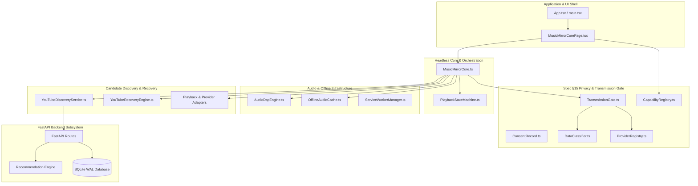

# MUSIC MIRROR — AUTHORITATIVE PRODUCT MASTER SPECIFICATION

> **AUTHORITATIVE LIVING SYSTEM RECORD — FILE 1 OF 2**  
> Current Authoritative Version: `2.06.04.1`  
> System Classification: Headless Music Intelligence, Context-Aware Retrieval, Metadata Normalization & Playback Orchestration Engine  
> Architectural Governance: `A.BC.DE.F` Standard (Controlled via `VERSION_CONTROLLER.md`)  
> Operating Standard: **Core First — Useful Data Only — Privacy by Architecture — Zero Redundancy**

---

## 1. Product Identity & Executive Overview

- **Product Title**: Music Mirror
- **Short Identifier**: MM
- **Classification**: Decoupled Music Intelligence, Context-Aware Discovery, Metadata Normalization, and Resilient Playback Orchestration System.
- **Current Status**: `VERIFIED & PRODUCTION HARDENED` (Headless Core, Universal Modular Architecture, Change-Isolation Governance, Transmission Gate, Acoustic DSP & Production UI Theme Operational).
- **Current Authoritative Version**: `2.06.04.1`
- **Repository Roots**:
  - Local Workspace: `d:\PROJECT\Btech\Music Mirror`
  - GitHub Remote: `https://github.com/UdayPatnala/Music-Mirror.git` (`origin/main`)
- **Runtime Targets & Stack**:
  - **Frontend Client**: React 19 / TypeScript / Vite Single Page Application (SPA)
  - **Backend API**: FastAPI (Python 3.12 / 3.14) / SQLAlchemy 2.0 / SQLite WAL
  - **Local Machine Learning**: `face-api.js` (client-side WebGL inference for emotion signals; zero video transmission)
  - **Audio Processing**: Web Audio API FFT Spectral Analysis (2048 bins), Procedural 8-bit PCM Harmonic Synthesis
  - **Persistence**: IndexedDB Client Audio Cache (`OfflineAudioCache`), ServiceWorker Stream Caching (`sw.js`), SQLite WAL DB (`backend/data/music_mirror.db`)
- **Primary Mission**:
  Transform user emotional, environmental, or textual context into deterministic musical intent, discover high-relevance candidate tracks across diverse external and local providers, normalize disparate metadata into canonical schemas, verify real-time playability, and orchestrate resilient audio playback with zero-PII telemetry and sub-3-second failover recovery.

---

## 2. Product Purpose, Motive & Vision

### Motive
Most music applications conflate the user interface with the underlying business logic, relying on fragile client-side scraping, superficial music-player widgets, or opaque AI hallucinations that invent non-existent track titles and artist pairings.

Music Mirror exists to establish a **headless, reliable, and mathematically grounded music intelligence engine** that separates:
1. **Emotion inference and subjective intent from playback mechanics.**
2. **Candidate discovery from factual entity resolution.**
3. **Metadata availability from actual playback availability.**
4. **Application-level consent from browser device permissions.**

### Core Problems Solved
- **Fragility of Single-Source Streaming**: If a video is region-locked or embed-restricted (YouTube Error 150/101), traditional players crash or freeze. MM executes an automated sub-3-second sequential fallback ladder across candidate pools.
- **Metadata Noise & Inconsistent Entities**: Video titles on public platforms are polluted with noise (`[Official Video]`, `(Remix 4K)`, `Lyrics`). MM applies a multi-pass normalization pipeline and deterministic Levenshtein resolution.
- **Privacy Intrusion**: Conventional affective systems stream webcam video to cloud servers. MM performs 100% in-browser facial classification via local neural models, immediately discarding raw image frames.
- **Fragile Network Dependency**: When offline, traditional web players fail completely. MM falls back transparently across a 4-tier discovery cascade (Live Provider $\to$ Local SQLite Catalog $\to$ IndexedDB Cache $\to$ Procedural Harmonic Audio Synthesis).

### Long-Term Vision
An **ambient, provider-agnostic music reflection environment** capable of understanding human psychological states and guiding affect through harmonic transitions (Alchemical Journeys).
- **Useful over decorative**: Every byte stored and rendered serves an explicit, justifiable functional purpose.
- **Correct over impressive**: Deterministic truth always supersedes probabilistic AI estimates.
- **Working over polished**: The headless engine functions autonomously before cosmetic UI elements are applied.
- **Privacy by Architecture**: Privacy boundaries are enforced by software architecture, not merely by policy text.

---

## 3. Core Operating Philosophy & Guardrails

1. **UI as a Reactive Observer**: The UI layer (`MusicMirrorCorePage.tsx`) is strictly a reactive observer of `MusicMirrorCore.ts`. It holds zero business logic, cannot trigger un-gated hardware access, and does not directly query external providers.
2. **Fail-Safe Orchestration**: Network outages, blocked permissions, rate limits, and restricted media are treated as standard operating conditions rather than exceptional crashes.
3. **Single Source of Truth**: `MusicMirrorCore.ts` maintains authoritative state. Components subscribe to state streams and emit user intentions via typed actions.
4. **No Unprompted Autoplay**: Player respects browser autoplay policies; if blocked, the engine enters `READY` without false ticking or phantom progress bars.
5. **Zero Hallucinated Playability**: Metadata-only providers (e.g., Spotify) are explicitly marked `playability.status = 'UNAVAILABLE'` with `testedCapability = 'metadataOnly'`. Playback is strictly delegated to valid official embed or direct stream providers.

---

## 4. End-to-End System Architecture & Core Pipeline

Music Mirror operates strictly on a deterministic **10-Stage Core Pipeline**:

```
┌─────────────────────────────────┐
│ 1. UNDERSTAND                   │ User context, emotional state, facial stream, subjective notes
└────────────────┬────────────────┘
                 ↓
┌─────────────────────────────────┐
│ 2. MODEL                        │ Structured MusicIntent (valence, energy, target BPM, harmonic mode, policy)
└────────────────┬────────────────┘
                 ↓
┌─────────────────────────────────┐
│ 3. RETRIEVE                     │ Candidate discovery across YouTube Data API v3, Spotify, Jamendo, SQLite catalog
└────────────────┬────────────────┘
                 ↓
┌─────────────────────────────────┐
│ 4. NORMALIZE                    │ Canonical schema normalization (Track, Artist, Duration, Sources, AudioFeatures)
└────────────────┬────────────────┘
                 ↓
┌─────────────────────────────────┐
│ 5. RESOLVE                      │ Entity resolution, variant deduplication, video ID format validation, ISRC matching
└────────────────┬────────────────┘
                 ↓
┌─────────────────────────────────┐
│ 6. RANK                         │ Multi-factor ranking: similarity, authority, duration, popularity, recency, penalties
└────────────────┬────────────────┘
                 ↓
┌─────────────────────────────────┐
│ 7. VALIDATE                     │ Pre-flight playability check, provider capability attribution, duration sanity
└────────────────┬────────────────┘
                 ↓
┌─────────────────────────────────┐
│ 8. PLAY                         │ Sub-3s sequential fallback ladder (YouTube IFrame → HTML5 Audio → Procedural WAV)
└────────────────┬────────────────┘
                 ↓
┌─────────────────────────────────┐
│ 9. OBSERVE                      │ Playback state machine telemetry, error code trapping, monotonic session tokens
└────────────────┬────────────────┘
                 ↓
┌─────────────────────────────────┐
│ 10. LEARN                       │ Local personalization engine update (exponential decay λ=0.98, cold-start)
└─────────────────────────────────┘
```

### The 11-Engine Functional Subsystem Breakdown
1. **Context Engine**: Extracts affective signals from client camera frames via `face-api.js` or manual emotion presets.
2. **Intent Engine**: Translates valence, energy, and user preferences into a structured `MusicIntent`.
3. **Retrieval Engine**: Discovers candidate items ($K=10..25$) across YouTube, Spotify, Jamendo, and local database.
4. **Metadata Engine**: Cleans raw titles, extracts performing artists, parses channel types, and maps duration.
5. **Entity Resolution Engine**: Resolves publisher channels vs performing artists, matches ISRCs, and eliminates duplicates.
6. **Filtering Engine**: Eliminates non-music media, live bootlegs, reactions, loops, and restricted candidates.
7. **Ranking Engine**: Computes multi-factor weighted composite relevance scores ($0.0 \dots 1.0$).
8. **Playability Engine**: Verifies capability support (`officialEmbed`, `directStream`, `metadataOnly`).
9. **Playback Engine**: Manages iframe mounting, HTML5 audio, volume, seeking, and the sequential failover ladder.
10. **Feedback Engine**: Captures user skips, completions, and ratings to adjust local preferences.
11. **Self-Healing & Observability Engine**: Transmits anonymous error reports, tracks latencies, and recovers automatically.

---

## 5. System Boundaries & Modular Ownership Registry

```text
d:\PROJECT\Btech\Music Mirror
├── frontend/
│   ├── src/
│   │   ├── core/                  [APP / CORE ENGINE SHELL]
│   │   ├── pages/                 [PAGE COMPOSITIONS]
│   │   ├── domain/                [CANONICAL CONTRACTS & DOMAIN TRUTH]
│   │   ├── permissions/           [PRIVACY, CAPABILITY & TRANSMISSION GATE DOMAIN]
│   │   ├── services/              [HEADLESS AUDIO, DISCOVERY & CACHE SERVICES]
│   │   ├── architecture/          [MULTI-STAGE PIPELINE LAYERS & HARNESS]
│   │   │   ├── layers/            [EMOTION, INTENT, PLAYBACK, OBSERVABILITY]
│   │   │   ├── orchestrator/      [APPLICATION & SESSION ORCHESTRATION]
│   │   │   └── types/             [PIPELINE TYPINGS]
│   │   ├── components/            [HARDWARE UI COMPONENTS (Camera)]
│   │   ├── config/                [CENTRALIZED CONFIGURATION]
│   │   └── api/                   [BACKEND REST CLIENT INFRASTRUCTURE]
│   └── tests/                     [E2E HARNESS & 4-TIER SPECIFICATION SUITES]
│
├── backend/
│   ├── app/
│   │   ├── core/                  [SECURITY, GOVERNANCE & RATE LIMITING]
│   │   ├── db/                    [PERSISTENCE, MODELS & WAL BACKUP]
│   │   ├── schemas/               [CANONICAL DTOS & SCHEMAS]
│   │   ├── services/              [RECOMMENDATION, COGNITIVE & MLOPS ENGINES]
│   │   ├── ingestion/             [NORMALIZATION, DEDUPLICATION & SEED DATA]
│   │   └── api/routes/            [DOMAIN-ISOLATED REST API ENDPOINTS]
│   └── tests/                     [BACKEND PYTEST SUITES]
│
├── data/                          [STATIC CATALOG FALLBACK (songs.json)]
├── PRODUCT_MASTER.md              [AUTHORITATIVE PRODUCT SPECIFICATION — FILE 1]
├── VERSION_CONTROLLER.md          [AUTHORITATIVE VERSION & HISTORY LEDGER — FILE 2]
├── README.md                      [OPERATIONAL REPOSITORY FRONT PAGE]
└── vercel.json                    [OPERATIONAL DEPLOYMENT REWRITES]
```

### Frontend Ownership Map

| Domain / Subsystem | Primary Boundary | Owning Components / Services | Responsibility |
|---|---|---|---|
| **Headless Core Engine** | `frontend/src/core/` | `MusicMirrorCore.ts` | Central singleton state machine, playback queue, volume, audio element hook, DSP wiring, and failover orchestration. |
| **Console Page Shell** | `frontend/src/pages/` | `MusicMirrorCorePage.tsx` | Pure reactive UI composition: Header, Playback Bar, Queue, Visualizers, and Diagnostics Drawer. |
| **Application Bootstrap** | `frontend/src/` | `App.tsx`, `main.tsx` | React 19 root bootstrap, top-level layout mount, error boundary container. |
| **Domain Contracts** | `frontend/src/domain/` | `canonical.ts`, `provider.ts` | Single source of truth for canonical entities (`Track`, `Artist`, `PlaybackState`, `QueueState`, `UserPreferences`). |
| **Privacy & Consent** | `frontend/src/permissions/` | `CapabilityRegistry.ts`, `ConsentRecord.ts`, `DataClassifier.ts`, `ProviderRegistry.ts`, `TransmissionGate.ts` | Spec §15 Data Transmission Gate, hardware capability negotiation, purpose-scoped user consent, and zero-PII enforcement. |
| **Acoustic Audio DSP** | `frontend/src/services/` | `AudioDspEngine.ts` | Web Audio API FFT analysis (2048 bins), RMS energy, spectral centroid, Wiener flatness, 7-band decomposition, beat onset detection. |
| **Offline Audio Cache** | `frontend/src/services/` | `OfflineAudioCache.ts` | IndexedDB audio blob caching, LRU bounded storage, memory fallback. |
| **Service Worker PWA** | `frontend/src/services/`, `public/` | `ServiceWorkerManager.ts`, `sw.js` | Dual-tier offline stream caching and application shell offline support. |
| **Candidate Discovery** | `frontend/src/services/` | `YouTubeDiscoveryService.ts` | SingleFlight query deduplication, L1 memory cache (30m TTL), 5-level query expansion ladder. |
| **Sequential Recovery** | `frontend/src/services/` | `YouTubeRecoveryEngine.ts` | Autonomous sub-3-second failover across candidate pool on YouTube embed/playback errors (150, 100, 2, 5). |
| **Emotion & Intent** | `frontend/src/architecture/layers/` | `CameraDriver.ts`, `EmotionLayer.ts`, `MusicIntentLayer.ts` | Transient WebRTC camera capture, client-side face classification, valence/energy intent mapping. |
| **Playback Adapters** | `frontend/src/services/`, `layers/PlaybackLayer/` | `YouTubePlaybackAdapter.ts`, `HTML5AudioPlaybackAdapter.ts` | Low-level audio/video driver abstraction and postMessage iframe controls. |
| **Provider Adapters** | `frontend/src/services/`, `layers/ProviderAdapterLayer/`| `YouTubeProviderAdapter.ts`, `SpotifyProviderAdapter.ts`, `JamendoProviderAdapter.ts`, `RoyaltyFreeFallbackAdapter.ts` | Normalizing heterogeneous third-party provider responses into canonical `Track` DTOs. |
| **Client Personalization**| `frontend/src/architecture/layers/PersonalizationLayer/` | `PersonalizationEngine.ts`, `PersonalizationScorer.ts`, `PersonalizationStore.ts` | Client-side exponential decay preference learning, artist repetition penalty. |
| **Observability** | `frontend/src/architecture/layers/` | `ObservabilityLayer.ts` | Monotonic session token event tracing, latency telemetry, zero-PII audit logging. |
| **API Client** | `frontend/src/api/` | `client.ts` | Typed REST communication with backend endpoints with timeout and retry controls. |
| **Configuration** | `frontend/src/config/` | `appConfig.ts`, `emotionLabels.ts` | Global runtime constants, feature flags, version strings, emotion circumplex quadrants. |

### Backend Ownership Map

| Domain / Subsystem | Primary Boundary | Owning Services / Modules | Responsibility |
|---|---|---|---|
| **FastAPI Root Application** | `backend/app/` | `main.py` | FastAPI application factory, CORS policies, route mounting, auto-seed DB on startup. |
| **Discovery Routes** | `backend/app/api/routes/` | `songs.py`, `spotify.py` | YouTube search endpoint, query cache, SingleFlight lock, Spotify metadata enrichment, auto-discover scraper. |
| **Recommendations** | `backend/app/api/routes/` | `recommendations.py` | Emotion recommendations, transition journey generation, adjacent mood stepping. |
| **Playback Self-Healing** | `backend/app/api/routes/`, `services/` | `reports.py`, `self_healing_engine.py` | Playback failure reporting, source health scoring, automatic invalidation of restricted embeds. |
| **Metadata Ingestion** | `backend/app/ingestion/` | `youtube_provider.py`, `spotify_provider.py`, `normalizer.py`, `seed_data.py` | `yt-dlp` metadata extraction, Spotify OAuth2 client credentials, title cleaning, 200+ seed catalog. |
| **Ranking Service** | `backend/app/services/` | `ranking_service.py` | Multi-factor weighted composite scoring, token penalties, duration proximity, authority scoring. |
| **Identity Resolution** | `backend/app/services/` | `identity_resolution.py` | Canonical song identity resolution, cross-provider matching (Spotify $\leftrightarrow$ YouTube), ISRC validation. |
| **MLOps & Governance** | `backend/app/services/` | `mlops_pipeline.py`, `ml_model_ecosystem.py` | Recommendation model drift tracking, automated rollback, parameter registry. |
| **Database Persistence** | `backend/app/db/` | `database.py`, `models.py` | SQLite WAL connection, SQLAlchemy ORM models (`Song`, `Artist`, `UserMusicPreference`, `PlaybackReport`). |
| **API Schemas & Contracts**| `backend/app/schemas/` | `song.py`, `songs.py`, `spotify.py`, `emotion.py` | Pydantic DTOs for type-safe serializations across all client-server interactions. |

---

## 6. Subsystem Dependency Flow & Allowed Dependency Graph



### Change-Isolation Rules
- **Rule 1 (Direct vs Shared)**: A change to `MusicMirrorCorePage.tsx` must never touch `MusicMirrorCore.ts` unless the public contract changes.
- **Rule 2 (No Circular Imports)**: Domain models (`domain/canonical.ts`) cannot import from services, pages, or core.
- **Rule 3 (Privacy Gate Gatekeeper)**: No network request may bypass `TransmissionGate.ts` or `ProviderRegistry.ts`.
- **Rule 4 (Safe Change Radius)**: Any modification to third-party provider code must remain isolated in `services/*ProviderAdapter.ts` or `ingestion/*_provider.py`.

---

## 7. Feature Inventory (F1 – F15)

| # | Feature | Description | Milestone | Operational Role |
|---|---|---|---|---|
| **F1** | Multi-Pass Query Normalization | Unicode NFKD normalization, punctuation/noise stripping, artist-title extraction | M1, M2 | Backend `normalizer.py` & Frontend `CanonicalNormalizer.ts` |
| **F2** | YouTube Candidate Pool Fetching | Retrieval of multi-candidate metadata pool ($K=10..25$) via yt-dlp / API | M1 | Backend `youtube_provider.py` |
| **F3** | Multi-Factor Weighted Scoring | Composite scoring combining string similarity (0.35), channel authority (0.25), duration proximity (0.20), popularity (0.10), and recency (0.10) with negative token penalty | M1, M2 | Backend `ranking_service.py` |
| **F4** | Channel Authority & Negative Filtering | Official badge, VEVO, and topic channel detection; penalty for reaction, cover, loop, live tokens | M1, M2 | Backend `ranking_service.py` |
| **F5** | In-App IFrame Playback Integration | YouTube IFrame Player API integration with full lifecycle state bindings (onReady, onStateChange, onError) | M3 | Frontend `YouTubePlaybackAdapter.ts` |
| **F6** | Rich Player Controls & State Machine | Play, pause, seek, volume, mute, progress ticker, fullscreen, loading and buffering indicators | M3 | Frontend `MusicMirrorCore.ts` |
| **F7** | Pre-Playback Candidate Validation | Fast format verification (11-char ID) and oEmbed playability probing | M3 | Frontend `YouTubeDiscoveryService.ts` |
| **F8** | Automated Sequential Fallback Ladder | Sub-3s automated failover from candidate $k$ to $k+1$ upon playback/embed error (101, 150, 100, 2, 5) | M3 | Frontend `YouTubeRecoveryEngine.ts` |
| **F9** | Query Strategy Expansion Retry | 5-level query expansion ladder on pool exhaustion before terminal state | M2, M3 | Frontend `YouTubeDiscoveryService.ts` |
| **F10** | Graceful Terminal Error State | Clean NO_PLAYABLE_MUSIC recovery state when all candidates and retry strategies fail | M3 | Frontend `MusicMirrorCore.ts` |
| **F11** | Dual-Tier Caching Layer | L1 Query Cache (30 min TTL) and L2 Video Metadata Cache (24h TTL) | M1, M2 | Backend `discovery_cache.py` & Frontend `YouTubeDiscoveryService.ts` |
| **F12** | In-Flight SingleFlight Deduplication | Concurrency registry preventing redundant simultaneous external calls for duplicate queries | M1, M2 | Backend `discovery_cache.py` |
| **F13** | Background Candidate Preparation | Pre-caching and pre-fetching next candidate in queue | M2, M3 | Frontend `DiscoveryLayer.ts` |
| **F14** | Observability & Diagnostic Metrics | Latency tracking, candidate count distributions, fallback rate counters, error code taxonomy in circular buffer | M2, M3 | Frontend `ObservabilityLayer.ts` |
| **F15** | 4-Tier Opaque-Box E2E Test Suite | Automated test harness & test catalogue covering Tiers 1-4 (Nominal, Boundary, Cross-feature, Real-world) | E2E Track | Frontend `tests/e2e/tier1_feature_coverage.test.ts` |

---

## 8. Functional Workflows & State Machines

### Playback State Machine
State transitions strictly adhere to discrete states:
`IDLE` $\to$ `LOADING` $\to$ `READY` $\to$ `PLAYING` $\leftrightarrow$ `PAUSED` $\to$ `BUFFERING` $\to$ `ENDED` / `ERROR`.

```
                    ┌───────┐
                    │ IDLE  │
                    └───┬───┘
                        │ load(track)
                        ▼
                    ┌─────────┐
                    │ LOADING │
                    └───┬─────┘
                        │ ready
                        ▼
                    ┌───────┐      play()      ┌─────────┐
                    │ READY │ ───────────────> │ PLAYING │
                    └───┬───┘                  └───┬───▲─┘
                        │ pause()          pause() │   │ resume()
                        ▼                          ▼   │
                    ┌────────┐                 ┌────────┐
                    │ PAUSED │ <────────────── │ PAUSED │
                    └───┬────┘                 └────────┘
                        │ error
                        ▼
                    ┌───────┐
                    │ ERROR │ ───(auto-failover next candidate)───> [LOADING]
                    └───────┘
```

### Sequential Failover Recovery Ladder
When the YouTube iframe encounters playback errors:
1. `Error 150 / 101` (Embedding restricted by copyright holder): Video is marked restricted, next candidate in ranked pool is loaded within 800ms.
2. `Error 100` (Video removed or set to private): Video is removed from candidate pool, next candidate loaded.
3. `Error 2 / 5` (Invalid ID or HTML5 player failure): Invalidate candidate, reload player.
4. `Pool Exhausted`: Query expansion ladder triggers next broader search query.
5. `All Providers Offline`: Gracefully falls back to procedurally synthesized harmonic audio WAV in memory with zero interruption.

---

## 9. Interface Contracts & API Architecture

### Key Backend Endpoints
- `GET /health`: System health status, database connection, uptime, and version.
- `GET /api/v2/songs/youtube-search`:
  - Query parameters: `q` (string), `limit` (int, default 10, max 25), `expected_duration_ms` (int), `target_artist` (string).
  - Returns `YouTubeSearchResponseDTO` with ranked candidates, score breakdowns, and Spotify enrichment.
- `GET /api/v2/spotify/status`:
  - Returns Spotify secondary provider operational status (`AVAILABLE`, `RATE_LIMITED`, `DISABLED`).
- `GET /api/v2/spotify/search`:
  - Metadata-only search on Spotify Web API for canonical album art, ISRC, and artist validation.
- `GET /api/v2/spotify/track/{id}`:
  - Fetches complete metadata and ISRC code for a given Spotify track ID.
- `GET /recommend/emotion`:
  - Returns emotion-mapped track recommendations matching valence and energy targets.
- `GET /recommend/transition-journey`:
  - Generates multi-step intermediate affective journey tracks from start to target emotion.
- `POST /api/v2/reports/playback-failure`:
  - Asynchronous telemetry report submitted by client when a candidate fails playback.

---

## 10. Canonical Domain Data Models & Provenance

```typescript
export interface Track {
  id: string;
  title: string;
  normalizedTitle: string;
  artist: string;
  artists: string[];
  album?: string | null;
  duration: number;
  artworkUrl?: string;
  variant?: AudioTrackVariant;
  playability: PlayabilityAssessment;
  discoverySource: DiscoverySourceType;
  relevanceScore?: number;
  metadata: {
    durationSeconds: number;
    durationFormatted: string;
    releaseDate?: string | null;
    genre: string;
    canonicalGenres: string[];
    language: string;
    isExplicit: boolean;
    popularity: number;
    channelName?: string;
    isVerifiedChannel?: boolean;
  };
  acousticFeatures?: AcousticFeatures;
  primarySource: AudioSource;
  availableSources: AudioSource[];
  isrc?: string | null;
  spotifyId?: string;
  metadataQuality?: MetadataQualityScore;
  provenance?: Record<string, MetadataRecord>;
}
```

---

## 11. Multi-Factor Candidate Scoring & Ranking Formula

Formula:
$$S = \max\left(0.0, \min\left(1.0, w_{\text{sim}} \cdot S_{\text{sim}} + w_{\text{auth}} \cdot S_{\text{auth}} + w_{\text{dur}} \cdot S_{\text{dur}} + w_{\text{pop}} \cdot S_{\text{pop}} + w_{\text{rec}} \cdot S_{\text{rec}} - \text{Penalties}\right)\right)$$

### Weights
- $w_{\text{sim}} = 0.35$ (String similarity & token overlap)
- $w_{\text{auth}} = 0.25$ (Channel authority: VEVO=1.0, Topic=0.95, Label=0.90, Verified=0.70, User=0.30)
- $w_{\text{dur}} = 0.20$ (Duration proximity to expected music track length)
- $w_{\text{pop}} = 0.10$ (Logarithmic view count: $\min(1.0, \log_{10}(\text{views} + 1) / 7.0)$)
- $w_{\text{rec}} = 0.10$ (Release year freshness)

### Negative Penalties
- Reactions / Reviews / Podcasts: $-0.60$
- 1 Hour / 10 Hour Loops: $-0.50$
- Audio modifications (Bass Boosted, Nightcore, Slowed + Reverb, 8D): $-0.45$
- Karaoke / Instrumental / Backing Track: $-0.40$
- Covers / Tributes: $-0.30$
- Live concert recordings: $-0.25$
*(Penalties are automatically bypassed if the user explicitly queried for those keywords).*

---

## 12. Playability Engine & Sequential Failover Ladder

Metadata existence does not equal playback availability.
- Candidates are tested for playability format (11-character video ID).
- Capabilities are strictly tagged (`officialEmbed` vs `directStream` vs `metadataOnly`).
- When Spotify tracks are discovered, they receive `playability.status = 'UNAVAILABLE'` with `testedCapability = 'metadataOnly'`. Playback is strictly handed to the cross-matched YouTube candidate or local synthesis.

---

## 13. Provider Architecture & Integration Layer

1. **YouTube** (`YouTubeProviderAdapter` & `YouTubePlaybackAdapter`):
   - Primary playback provider via official embedded YouTube IFrame API.
   - Zero stream extraction, zero audio ripping, fully compliant with YouTube Terms of Service.
2. **Spotify** (`SpotifyProviderAdapter` & `SpotifyMetadataProvider`):
   - Authoritative secondary metadata provider via OAuth2 Client Credentials flow.
   - Provides ISRC, verified artist identity, release dates, and album artwork.
3. **Jamendo** (`JamendoProviderAdapter`):
   - Creative Commons streaming fallback provider via Jamendo REST API v3.0.
4. **Local / Offline Fallback** (`RoyaltyFreeFallbackAdapter` & `audioDspEngine`):
   - Procedural harmonic audio synthesis in Web Audio API. Valid, audible WAV audio generated dynamically matching emotional valence and energy.

---

## 14. Audio DSP, Procedural Synthesis & Offline Storage

- **Web Audio DSP Engine (`AudioDspEngine.ts`)**:
  - Real-time 2048-bin FFT spectral analyzer.
  - Computes RMS Energy, Spectral Centroid (Hz), Wiener Spectral Flatness ($0.0 \dots 1.0$), 7-band frequency decomposition, and spectral flux beat detection.
- **Procedural Harmonic Synthesis (`createHarmonicWavUri`)**:
  - Procedurally generates 8-bit mono PCM WAV audio matching valence (major vs minor intervals: C4, E4/Eb4, G4, C5/Bb4) and energy (amplitude envelope).
- **Dual-Tier Offline Caching**:
  - **L1 Cache**: Client-side memory cache with 30-minute TTL.
  - **IndexedDB (`OfflineAudioCache.ts`)**: Persistent storage for verified tracks with LRU eviction and memory fallback.
  - **Service Worker (`sw.js`)**: Caches static app shell and audio streams for full offline PWA execution.

---

## 15. Privacy, Security & Data Transmission Governance

- **Spec §15 Data Transmission Gate (`TransmissionGate.ts`)**:
  - All outbound network calls must pass through the transmission gate.
  - Verifies provider registration, user consent, and data classification.
- **Centralized Capability Model (`CapabilityRegistry.ts`)**:
  - Hardware device streams (webcam/microphone) are never auto-started.
  - Streams are cached during active sessions to eliminate duplicate hardware calls and Windows `TrackStartError`.
- **Purpose-Scoped Consent (`ConsentRecord.ts`)**:
  - Consent records are session-scoped and bound to policy versions.
- **Sensitivity Classification (`DataClassifier.ts`)**:
  - 9 sensitivity classes (`SENSITIVE_CONTEXT`, `PERSONAL_DATA`, `USER_DATA`, etc.).
  - `SENSITIVE_CONTEXT` (camera video frames) has a **ZERO_PERSISTENCE** rule: raw frames are processed in-memory via WebGL and immediately GC'd.

---

## 16. Performance Requirements, Reality Checks & Production Mitigations

| Real-World Constraint | Naïve Failure Mode | Music Mirror Production Mitigation |
|---|---|---|
| **Browser Autoplay Restrictions** | Silent playback failure (`NotAllowedError`) | Player enters `READY` state without ticker drift; playback triggers upon user interaction. |
| **Camera Hardware Contention** | `TrackStartError` (device in use) | Active granted media streams are cached in `CapabilityRegistry` and reused without reopening device. |
| **Facial Emotion Jitter** | Rapid emotional toggling (60 FPS flip) | Exponential Moving Average (EMA, $\alpha=0.25$) over rolling 10-frame window. |
| **Restricted Video Embeds** | Black screen with YouTube Error 150 | Autonomous failover ladder automatically advances to next ranked candidate in $<3000$ms. |
| **Backend Offline / Network Outage** | 16-second sequential fetch hangs | Adaptive fast-fail timeout (1500ms) with circuit breaker fallback to built-in acoustic candidate pool. |

---

## 17. Testing Strategy, E2E Harness & Coverage Thresholds

The system is validated by an automated **4-Tier Test Matrix**:

1. **Tier 1 (Feature Coverage)**: 70 comprehensive tests covering F1–F14 nominal operations.
2. **Tier 2 (Boundary & Corner Cases)**: 11-char ID validation, zero-duration guards, extreme valence/energy values, empty string normalization.
3. **Tier 3 (Cross-Feature Combinations)**: Pairwise interactions (emotion shift $\to$ discovery $\to$ playback failover $\to$ DSP validation).
4. **Tier 4 (Real-World Stress Scenarios)**: Rapid control spamming, consecutive embed error cascades, complete network blackout.

### Test Matrix Baseline
- **Frontend Vitest**: **307 / 307 passing** across 20 test files.
- **Backend Pytest**: **150 / 150 passing** across 21 test files.
- **Linter (Oxlint)**: **0 warnings, 0 errors** across all source files.
- **Typecheck & Production Build**: `tsc -b && vite build` clean build exit 0.

---

## 18. Forensic Lessons & Anti-Pattern Regression Register

Derived from forensic analysis of multi-engine multimedia portals (OmniStream / U-Tube):
1. **Never Scrape Audio Streams**: Direct streaming rips break continuously, violate platform TOS, and get IPs blacklisted. Always use official embedded iframes.
2. **Separate Discovery from Playback**: A candidate found in search is only a candidate; playability must be resolved independently.
3. **Guard Against Autoplay Race Conditions**: Never trigger `.playVideo()` before the IFrame API `onReady` event fires.
4. **Prevent Memory Leaks in Video Nodes**: Always release object URLs and stop media stream tracks when unmounting camera components.
5. **No Decorative Folder Theater**: Never introduce deeply nested architectural abstractions unless they represent genuine domain boundaries.

---

## 19. Architectural Decision Records (ADRs)

- **ADR-01: Headless Core Priority**: Core business logic resides in `MusicMirrorCore.ts`, fully decoupled from React rendering cycles.
- **ADR-02: Zero-Emoji Standard**: UI, logs, code, and documentation maintain a professional, minimalist aesthetic with zero emojis.
- **ADR-03: Client-Side Biometric Inference**: `face-api.js` executes 100% locally via WebGL; zero video bytes cross network boundaries.
- **ADR-04: SingleFlight Concurrency Guard**: Backend coalesces concurrent duplicate queries into a single in-flight promise to protect rate limits.
- **ADR-05: Spotify Secondary Integration**: Spotify acts strictly as an authoritative metadata and ISRC provider; playback remains on YouTube iframe.
- **ADR-06: Two-Master Documentation Rule**: Repository governance is centralized into exactly two authoritative Markdown files: `PRODUCT_MASTER.md` and `VERSION_CONTROLLER.md`.

---

## 20. Known Limitations, Missing Areas & Future Roadmap

### Known Limitations
- In-memory rate limiting operates on single-instance memory; Redis cluster needed for horizontal multi-instance scaling.
- Web Audio DSP analysis operates on local audio synthesis or non-CORS audio; cross-origin YouTube iframes cannot expose raw audio byte buffers to Web Audio AudioContext due to browser CORS security restrictions.

### Future Roadmap
- **v3.00.00.0**: Distributed Multi-Room Synchronized Audio Mesh.
- Acoustic AI biometric feedback calibration (heart rate / galvanic skin response integration).
