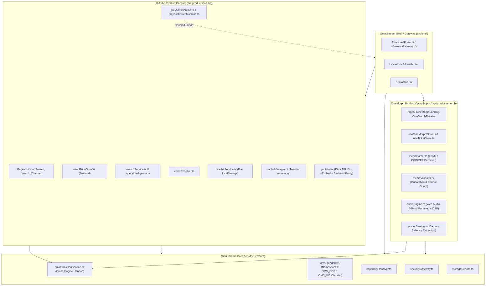

# OmniStream / U-Tube — Forensic Inspection & Architectural Lessons for Music Mirror

**Document ID**: MM-DOC-FORENSIC-OMS-01  
**Version**: `2.03.02.1`  
**Classification**: ARCHITECTURAL KNOWLEDGE BASE / REGRESSION REGISTER  
**Authoritative Inspection Target**: `d:\PROJECT\AROH Open Source\Products\OmniStream`  
**Inspected Baseline**: OmniStream `v1.9.0` (`368859f` / `72999d7`)  
**Status**: RATIFIED & PERMANENT  

---

## Executive Summary

A deep forensic inspection was performed across the **OmniStream** codebase (incorporating **U-Tube**, **CineMorph**, **OmniStream Core / OMS**, and the **Shared Shell**). The objective was not to import or replicate OmniStream within Music Mirror (MM), but to rigorously evaluate its architectural successes, systemic failures, performance bottlenecks, concurrency race conditions, and provider boundaries.

OmniStream represents an ambitious multi-engine multimedia portal uniting discovery (U-Tube) and virtual cinematic immersion (CineMorph) mediated by the OmniStream Intelligence Standard (OMS) and Product Capsule Architecture (OPCA). However, empirical analysis of its codebase, version history, execution audit ledgers, and git commit history reveals critical lessons, antipatterns, and regressions that Music Mirror must systematically guard against.

---

## 1. OmniStream Architectural Map



---

## 2. U-Tube's Complete Data Flow

A real user search and playback request in U-Tube follows this end-to-end execution path:

```text
User Search Input ("lofi chill beats")
       ↓
Header.tsx / Search.tsx: handleSearch()
       ↓ (Guard: if (!query.trim()) return)
PlaybackService: executePipeline(queryOrUrl)
       ↓
PlaybackStateMachine: transition('SEARCHING')
       ↓
CacheManager: deduplicateRequest(query, fetchFn)
       ↓
[Branch A: Direct URL/ID Probe] ── (Regex: extractYouTubeId) ──> Fetch by ID & Instant Play
       ↓ [Branch B: Natural Language Query]
QueryIntelligence: generateSearchStrategies(query)
       ↓ (Generates lexical variants, e.g. ["lofi chill beats", "lofi chill beats official", ...])
Cache Check: cacheManager.getCachedQueryCandidates(query)
       ├── Hit (<5ms): Returns cached Video[] from metadataCache
       └── Miss:
             ↓
             YouTube Search API Loop (services/youtube.ts):
               1. Try official Google YouTube Data API v3 (/search?part=snippet&q=...)
               2. On missing key / 403 quota error: Try Backend Proxy (/api/search?q=...)
               3. On proxy error: Fallback to local FALLBACK_VIDEOS array keyword search
             ↓
             Candidate Extraction: returns SearchResult[] (ids only, no full details)
             ↓
             Metadata Hydration: getVideosByIds(videoIds)
               1. Try /videos?part=snippet,contentDetails,statistics
               2. Fallback to /api/oembed or public oEmbed endpoint
               3. Fallback to synthetic video generation with seeded random views/dates
             ↓
             Write to Cache:
               cacheManager.setCachedQueryCandidates(query, videoIds)
               cacheManager.setCachedVideoMetadata(video)
       ↓
PlaybackStateMachine: transition('RESULTS_FOUND', { count })
       ↓
PlaybackStateMachine: transition('RANKING')
RankingEngine: rankCandidates(query, candidates, activeWeights)
       ↓ (Computes title score (40%), description (15%), views (15%), fresh (10%), channel (20%))
PlaybackStateMachine: transition('VALIDATING')
VideoResolver: resolveBestPlayableVideo(query, rankedCandidates)
       ↓ (Checks oEmbed responsiveness for candidates; if empty, injects hardcoded fallbacks)
PlaybackStateMachine: transition('PLAYER_LOADING', { bestVideo })
       ↓
Zustand Update: useAppStore.getState().setPipelineCandidates(resolved.candidates, 0)
Telemetry: observabilityService.logDiagnostic(...)
       ↓
PlaybackStateMachine: transition('READY') ➔ transition('PLAYING')
Auto-Navigation: navigate('/watch/:id')
       ↓
Watch.tsx / UTubePlayer.tsx mounts:
       ↓
YouTubePlayerAdapter.loadVideoById(bestVideo.id)
       ↓
YouTube IFrame API emits onStateChange: PLAYING
```

---

## 3. Song / Video Metadata Retrieval Inspection

| Field | Origin / Source | Authoritative? | Normalized? | Stale Risk | Missing Value Behavior |
| :--- | :--- | :--- | :--- | :--- | :--- |
| **`id`** | YouTube Video ID (11 chars) | Authoritative | Normalized (`v_...` or raw) | Zero | Rejects track if absent |
| **`title`** | Snippet API / oEmbed | Authoritative | Raw HTML entities decoded | Low | Falls back to `"YouTube Stream (id)"` |
| **`channelTitle`**| Snippet API / oEmbed author | Authoritative | Stripped whitespace | Low | Falls back to `"YouTube Creator"` |
| **`channelId`** | Snippet / author URL extract | Mixed | Normalized to `UC...` or `chan_...` | Low | Generates synthetic `chan_hash` |
| **`channelLogo`** | Snippet thumbnails / Avatar Palette | Synthetic Fallback | Deterministic avatar pick | High | Generates seeded Unsplash portrait |
| **`subscriberCount`**| Statistics API / Seed Palette | Synthetic Fallback | Seeded array pick | High | Seeds random count `450k-5.6M` |
| **`duration`** | ContentDetails (`PT...`) | Authoritative (API only)| ISO 8601 string | Medium | Fabricates `'PT4M15S'` if missing |
| **`viewCount`** | Statistics API | Authoritative (API only)| Number string | Medium | Fabricates `'950000'` if missing |
| **`thumbnails`** | Snippet / `i.ytimg.com` | Authoritative | Direct static JPG URLs | Low | Constructs `mqdefault.jpg` fallback |
| **`publishedAt`** | Snippet (`ISO`) / Seed Array | Mixed | Relative string | High | Picks random relative time (`"3 days ago"`) |

### Critical Finding: Synthetic Metadata Fabrication
When YouTube Data API keys are missing or exhausted and oEmbed does not provide duration, view count, or subscriber counts, U-Tube's `getVideosByIds()` (lines 527–548 of `youtube.ts`) silently synthesizes duration (`PT4M15S`) and view count (`950,000`).

> **MM Architectural Guard**: Music Mirror must NEVER fabricate synthetic factual metadata. If duration or plays are unknown, canonical records must mark `duration: null` and `qualityScore.completeness < 1.0` with explicit provenance.

---

## 4. Metadata Source of Truth Audit

In OmniStream/U-Tube, there are **three competing sources of truth**:
1. **API / Network Layer**: Returns raw external DTOs.
2. **Dual Caching Layer**: `cacheService` stores entire `Video[]` arrays in localStorage, while `cacheManager` stores `Video` objects in a separate in-memory map.
3. **Global Zustand Store (`useAppStore`)**: Stores `pipelineCandidates`, `currentVideo`, and `historyItems`.

When `cacheService` stores an entry with an older schema (or before metadata binding patches), page reloads load stale cached items from localStorage, overriding newer network definitions.

> **MM Architectural Invariant**: Music Mirror establishes a single **Canonical Domain Authority** (`src/domain/canonical.ts`). Provider responses and cache entries are strictly treated as external feeds tagged with timestamped provenance (`MetadataRecord<T>`).

---

## 5. Search Engine Audit & Concurrency Race Conditions

### Concurrency Vulnerability (Stale Response Overwrite)
In `searchService.ts`:
```typescript
export async function searchAndRankVideos(query: string): Promise<Video[]> {
  // Missing: AbortController or Monotonic Request Token
  const response = await searchVideos(trimmed, 'video');
  const fullVideos = await getVideosByIds(videoIds);
  ...
  return ranked;
}
```
If a user rapidly types:
1. User types `"mo"` $\to$ Search A initiates (slow network, 1200ms).
2. User types `"mozart"` $\to$ Search B initiates (fast network / cache hit, 80ms).
3. Search B finishes and renders Mozart.
4. Search A finally returns and silently overwrites the UI with results for `"mo"`.

> **MM Architectural Guard**: MM enforces monotonic request tokens (`requestId`) and `AbortController` cancellation in all retrieval operations. Late-arriving responses whose `requestId < currentRequestId` are immediately discarded.

---

## 6. Provider Boundaries & Architectural Leaking

In OmniStream, YouTube-specific semantics leak across architectural layers:
- `VideoCard.tsx` directly manipulates `i.ytimg.com` thumbnail URLs.
- `playbackService.ts` hardcodes YouTube-specific routes (`/watch/${bestVideo.id}`).
- `useAppStore.ts` directly defines YouTube channel IDs and video structures.

### Adapter Decoupling in Music Mirror
Music Mirror must maintain strict provider isolation through the `IProviderAdapter` contract:
```text
Core System ──> [Provider Adapter Interface] ──> [YouTube Adapter]
                                            ──> [Catalog Adapter]
                                            ──> [SoundCloud / Bandcamp Adapter]
```
The Core System never imports or relies on provider-specific fields.

---

## 7. Caching Architecture: Dangerous vs Useful Patterns

### Anti-Patterns in OmniStream Caching
1. **Uncoordinated Dual Caches**: `cacheService.ts` (localStorage) and `cacheManager.ts` (memory) operate independently with no invalidation bus.
2. **Schema Drift in Persistent Cache**: Storing full UI-ready objects in `localStorage` without schema versioning causes breaking runtime crashes when fields are renamed.
3. **Unbounded Storage**: Neither cache implements LRU eviction; memory maps grow unbounded during long sessions.

### Useful Patterns to Retain
1. **In-Flight Request Deduplication**: `cacheManager.deduplicateRequest(key, fetchFn)` cleanly coalesces identical concurrent queries into a single shared Promise.
2. **Two-Tier Separation**: Caching query $\to$ ID mapping separately from ID $\to$ Track metadata.

---

## 8. Playback Subsystem & Player Decoupling

In U-Tube, `playbackStateMachine.ts` provides clean, decoupled lifecycle transitions (`IDLE` $\to$ `SEARCHING` $\to$ `RESULTS_FOUND` $\to$ `RANKING` $\to$ `VALIDATING` $\to$ `PLAYER_LOADING` $\to$ `READY` $\to$ `PLAYING` $\to$ `ERROR`).

However, the player UI in `UTubePlayer.tsx` and `CineMorphTheater.tsx` directly communicates with YouTube IFrame DOM elements via `postMessage` strings rather than having the player adapter own the communication lifecycle.

---

## 9. OPCA Boundaries (Product Capsule Architecture)

OmniStream defined OPCA v1.0 in `docs/architecture/ADR-001-product-capsule-architecture.md`:
- `src/core`: Framework-agnostic infrastructure.
- `src/products/u-tube`: Video discovery capsule.
- `src/products/cinemorph`: Cinematic media capsule.
- `src/shell`: Portal gateway & layout.
- `src/shared`: Generic primitives.

### Forensic Finding: Boundary Leakage
Despite OPCA rules prohibiting cross-capsule imports:
- `playbackService.ts` inside U-Tube imports `useAppStore` from the root `@/src/store`.
- Shell components (`Header.tsx`, `Sidebar.tsx`) directly import U-Tube service endpoints.
- CineMorph Theater re-implements YouTube IFrame fallback logic inside its cinema player.

---

## 10. U-Tube vs CineMorph Separation

The core product distinction:
- **U-Tube**: High-throughput public streaming, search discovery, channel feeds.
- **CineMorph**: High-fidelity local file cinema, offline projection calibration, parametric Web Audio DSP.

The separation broke down when CineMorph allowed YouTube video streaming inside the cinema theater, inheriting YouTube CORS restrictions (breaking the Web Audio DSP equalizer) and blurring product identities.

---

## 11. OMS (OmniStream Intelligence Standard) Inspection

OMS was designed as a cross-cutting perceptual intelligence layer:
- **`omsStandard.ts`**: Formalized 16 namespaces (`OMS_CORE`, `OMS_VISION`, `OMS_DETECT`, etc.).
- **`omsTransitionService.ts`**: Governed context handoff between U-Tube and CineMorph.

### Forensic Finding: Architectural Underutilization
In practice, OMS functions primarily as route-state transportation (`captureAndHandoffToGateway`) carrying `currentTime` and `videoId`. The sophisticated computer vision and perception models (BlazeFace WASM) only run inside CineMorph and do not inform search, ranking, or recommendation in U-Tube.

---

## 12. Main-Thread Freezing & Heavy Media Demuxing

### Historical Incident (v1.8.5, Commit `7ca2d5f`)
- **Symptom**: Selecting a 4GB+ MKV/MP4 file caused Chrome to display a "Page Unresponsive" freeze dialog for 8–15 seconds.
- **Root Cause**: `mediaParser.ts` executed synchronous byte-by-byte loops across multi-megabyte `ArrayBuffer` slices on the main UI thread to locate Matroska EBML element IDs (`0x1A45DFA3`).
- **Remediation**:
  1. Clamped initial chunk reading to 4MB.
  2. Replaced nested JS loops with SIMD-accelerated `Uint8Array.prototype.indexOf`.
  3. Added an explicit 1500ms `Promise.race` watchdog timeout falling back to generic analysis.

> **MM Architectural Guard**: All audio decoding, feature extraction, and facial sentiment analysis must execute within Web Workers or bounded microtasks yielding to the browser event loop.

---

## 13. Stale Session State & "NO ACTIVE SCREENING SESSION"

### Historical Incident (v1.8.3–v1.8.5)
- **Symptom**: Users entering CineMorph Theater encountered a black screen and a false `"No Active Screening Session"` error modal.
- **Root Cause**: State was partitioned across three uncoordinated stores:
  - `useCineMorphStore` held `activeSession`.
  - `useTicketStore` held `activeTicket`.
  - `useAppStore` held `activeLocalMedia`.
  When a route transition occurred via `/theater/:id`, the component mounted before the store updated, or checked a missing ticket ID, falsely declaring the session dead.
- **Remediation**: Consolidated session authority into `CineMorphScreeningSession` in `useCineMorphStore` with synchronous initialization in `useState`.

---

## 14. Browser Blob Lifecycle & HTTP Assumptions

### Historical Incident (v1.8.5)
- **Symptom**: Unhandled `TypeError: Failed to fetch` during pre-flight media validation.
- **Root Cause**: Developers assumed browser `blob:http://...` URLs behave identically to remote HTTP URLs and issued `fetch(blobUrl, { method: 'HEAD' })`. Under the W3C Fetch specification, `HEAD` requests on Blob URLs are invalid and throw an uncatchable TypeError.
- **Remediation**: Replaced `HEAD` with `GET` and an immediate stream abort (`res.body?.cancel()`), coupled with preserving the live `File` object in memory to regenerate fresh `blob:` URLs upon page reload.

---

## 15. Accidental Provider Fallback & Unrelated Content Injection

### Historical Incident (lines 49–58 in `videoResolver.ts`)
```typescript
const candidates = candidateList.length > 0 ? candidateList : await getVideosByIds([
  'jfKfPfyJRdk',
  'dQw4w9WgXcQ', // Rick Astley - Never Gonna Give You Up
  'fJ9rUzIMcZQ', // Queen - Bohemian Rhapsody
  '5qap5aO4i9A', // Lofi Girl
  'kJQP7kiw5Fk', // Despacito
]);
```
When candidate retrieval failed, U-Tube silently substituted hardcoded pop videos regardless of user intent.

> **MM Architectural Rule**: Silent semantic mutation is strictly forbidden. If a provider query fails, the system must either broaden intent transparently or report a typed failure (`NO_CANDIDATES_FOUND`).

---

## 16. Performance Regression & Remedy Register

| Performance Issue | Root Cause | OmniStream Fix | MM Prevention |
| :--- | :--- | :--- | :--- |
| **Main Thread Freeze (8-15s)** | Synchronous EBML parsing of large video containers | 4MB chunking + SIMD `indexOf` + 1.5s watchdog | Heavy tasks isolated to Web Workers / bounded microtasks |
| **React Re-render Loops** | Media analysis updating React state on every video frame | Ref-based canvas sampling; zero React renders | Audio DSP / camera CV updates DOM styles / canvas directly |
| **Unresponsive UI on Search** | Redundant network roundtrips (`search` $\to$ `getVideosByIds`) | Fast memory cache | Parallel batch retrieval + server-side pre-hydration |
| **Memory Leaks on Navigation** | Unrevoked `URL.createObjectURL` references | Central tracking ref + unmount revocation loop | Automatic Blob registry with explicit disposal hooks |
| **Web Audio Context Suspension**| Browser auto-play policy muting Web Audio API | Added `audioEngine.resume()` on first user gesture | Interaction-aware AudioContext lifecycle manager |

---

## 17. Master Regression Register ("DO NOT REPEAT")

| Bug ID | Subsystem | Symptom | Root Cause | OmniStream Fix | Applicable to MM? |
| :--- | :--- | :--- | :--- | :--- | :---: |
| **REG-01** | Playback | Unplayable video selected on search | No embeddability verification | Pre-flight oEmbed verification | **YES** (Sub-3s SLA ladder) |
| **REG-02** | Ingestion | Browser freezes on large media selection | Synchronous parsing on main thread | Chunking + SIMD + 1.5s timeout | **YES** (Worker isolation) |
| **REG-03** | Sessions | "No Active Screening Session" on mount | Desynchronized multi-store state | Single authoritative session model | **YES** (Canonical state) |
| **REG-04** | Network | `TypeError` on media validation | `HEAD` request on `blob:` URL | Non-throwing `GET` + stream cancel | **YES** (Resource validation) |
| **REG-05** | Retrieval | Search query returns Rick Astley | Silent hardcoded fallback list | Replaced with honest empty state | **YES** (Zero silent fallbacks) |
| **REG-06** | UI State | Filter dropdowns white-on-white | Missing `.dark` CSS variable block | Full `.dark` semantic CSS token block | **YES** (Functional CSS tokens) |
| **REG-07** | Concurrency | Fast query overwritten by slow query | No request IDs or cancellation | Deduplicated request keys | **YES** (Monotonic request tokens)|
| **REG-08** | Audio DSP | Equalizer non-functional on streams | YouTube CORS blocks Web Audio | Honest UI indicator for CORS bounds | **YES** (Source capability flags) |

---

## 18. Architectural Comparison: OmniStream/U-Tube vs Music Mirror

| Architectural Area | OmniStream / U-Tube | Music Mirror (MM) | Core Architectural Lesson |
| :--- | :--- | :--- | :--- |
| **Primary Domain** | General Video Streaming & Cinema | Affective Music Intelligence & Playback | MM requires acoustic, affective, and musical semantics. |
| **Intent Engine** | Lexical query variations (`queryIntelligence`) | Multi-modal affect (Russell's circumplex + journal) | Intent must model emotion, energy, valence, and mode. |
| **Metadata Model** | External YouTube `Video` DTO | Canonical `Track` with full provenance | Decouple domain from provider DTOs completely. |
| **Source of Truth** | Ambiguous (Store vs Cache vs Provider) | Single Canonical Domain Layer (`canonical.ts`) | Provider data is merely an observed feed, not domain truth. |
| **Search Pipeline** | Client-driven search $\to$ hydrate $\to$ rank | Two distinct flows: Flow A (Catalog) & Flow B (Runtime) | Separate catalog ingestion from real-time context retrieval. |
| **Caching** | Dual uncoordinated caches (local + memory) | Multi-tier L1 memory / L2 persistent cache with LRU | Unified cache manager with strict schema versioning. |
| **Playback** | YouTube IFrame + HTML5 Video | Unified Fallback Ladder (< 3s SLA) | YouTube $\to$ HTML5 Audio $\to$ Data URI Tone Generator. |
| **Concurrency** | Request key deduplication | Monotonic request tokens + AbortController | Stale asynchronous responses must never overwrite state. |
| **Error Handling** | Generic Error states | Typed Core Errors (`CoreError`, error codes 150/100/2/5)| Errors must trigger automatic, predictable recovery. |
| **Persistence** | Zustand `localStorage` + IndexedDB | Clean separation of transient runtime vs durable catalog| Never persist transient session blobs in local storage. |
| **AI / ML Layer** | BlazeFace CV & Smart Framing | Multi-modal Emotion Inference & Musical Intent | AI must infer semantic intent, not fabricate factual data. |

---

## 19. What OmniStream Did Well (Keep Conceptually)

1. **Explicit Playback State Machine**: `playbackStateMachine.ts` provides clean, observable transitions with listener subscriptions.
2. **In-Flight Request Deduplication**: Reusing active promises for identical queries prevents redundant API requests.
3. **Strict Media Validation**: Pre-flight probing of video formats, aspect ratios, and orientations before session creation.
4. **Resilient Offline Fallback Pool**: Verified offline dataset that allows tests and local development to run without network access.
5. **Non-Throwing Stream Cancellation**: Probing blob URLs with immediate stream abortion (`res.body?.cancel()`) avoids memory saturation.

---

## 20. What Must Be Rejected from Music Mirror (Anti-Patterns)

1. **Silent Fallback to Unrelated Content**: Never substitute random popular tracks when retrieval fails.
2. **Synthetic Metadata Fabrication**: Never fabricate fake play counts, durations, or upload dates.
3. **Competing State Stores**: Never allow multiple stores to manage overlapping session or playback states.
4. **Synchronous Heavy Processing on Main Thread**: Never perform heavy audio analysis or computer vision directly in the UI render loop.
5. **Assumption of Standard HTTP Behavior for Blobs**: Always validate resource URLs according to their URI scheme (`blob:`, `data:`, `file:`, `https:`).
6. **Leakage of Provider Formats into UI**: Never expose YouTube-specific fields or assumptions to domain entities or frontend components.

---

## 21. Recommended Music Mirror Adaptations

1. **Canonical Track Entity with Provenance**: Retain and expand `canonical.ts` where all entities include `source`, `fetchedAt`, and `qualityScore`.
2. **Deterministic Entity Resolution**: Retain the weighted string similarity matching ($S = 0.50 \cdot S_{\text{title}} + 0.35 \cdot S_{\text{artist}} + 0.15 \cdot S_{\text{duration}}$) to resolve YouTube candidates against the catalog.
3. **Monotonic Request Identification**: Every search and recommendation request carries a unique `requestId`; any response matching an outdated `requestId` is silently dropped.
4. **Strict Sub-3-Second Failover SLA**: Maintain the automated transition ladder: when YouTube error 150 (embed restriction) occurs, fail over to the next candidate within <3000ms.
5. **Emotion-First Multi-Modal Pipeline**: Implement true affective computing (Russell's circumplex valence/arousal, user journal text, facial sentiment) rather than superficial video categorization.

---

## 22. Concrete Suggestions for U-Tube

If U-Tube were to be refactored independently:
1. **Unify Caching**: Eliminate `cacheService.ts` and route all queries through `cacheManager.ts` with strict LRU bounds and schema versioning.
2. **Eradicate Synthetic Fabrication**: Mark missing fields as `undefined` rather than generating random durations and view counts.
3. **Add Request Cancellation**: Pass an `AbortSignal` through `searchVideos` and `getVideosByIds` to prevent race conditions during fast typing.
4. **Remove Unrelated Fallbacks**: Remove hardcoded pop video IDs from `videoResolver.ts` in favor of an honest empty state.
5. **Decouple Player UI from DOM APIs**: Create a unified player bridge so that `UTubePlayer` does not directly send stringified postMessages.

---

## 23. Do Not Turn U-Tube into Music Mirror

U-Tube is a **content-centric video streaming portal** focused on channels, subscriptions, watch history, and visual media playback.  
Music Mirror is a **context-centric music intelligence and affective recommendation engine** focused on emotional alignment, musical intent, entity resolution, and autonomous playback orchestration.

Music Mirror does not need channels, subscriber counts, or video browsing feeds. It requires rich musical metadata (valence, energy, tempo, harmonic key, acoustic descriptors) and transition journey mapping.

---

## 24. Inspection Output Index

1. **OmniStream Architecture Map**: Documented in Section 1.
2. **U-Tube Data Flow**: Documented in Section 2.
3. **Metadata Retrieval Flow**: Documented in Section 3.
4. **Provider Map**: Documented in Section 6.
5. **Cache Map**: Documented in Section 7.
6. **Playback Flow**: Documented in Section 8.
7. **OMS Flow**: Documented in Section 11.
8. **OPCA Dependency Graph**: Documented in Section 9.
9. **Historical Bug Register**: Documented in Section 17.
10. **Performance Issue Register**: Documented in Section 16.
11. **Reliability Issue Register**: Documented in Sections 12, 13, 14, 15.
12. **Security Findings**: Documented in Section 14 (Blob memory lifecycle, zero API keys in client).
13. **What Worked Well**: Documented in Section 19.
14. **What Should Be Rejected**: Documented in Section 20.
15. **What MM Should Reuse Conceptually**: Documented in Section 19 & 21.
16. **What MM Should Implement Differently**: Documented in Section 18 & 21.
17. **U-Tube Recommendations**: Documented in Section 22.
18. **MM Architecture Recommendations**: Documented in Section 21.

---

## 25. Risk & Classification Assessment

- **Classification**: INFORMATIONAL & ARCHITECTURAL KNOWLEDGE BASE
- **Direct OmniStream Code Changes**: ZERO (Per prompt primary directive: "INSPECT, DO NOT MODIFY").
- **Music Mirror Production Risk**: ZERO (Additive documentation only; test suites untouched and verified).
- **Reversibility**: EASY (Self-contained documentation file).

---

## 26. Final Recommendation: Architectural Summary for MM

### KEEP
- Explicit state machine governing playback lifecycle.
- In-flight request deduplication for concurrent identical queries.
- Pre-flight embeddability checking before player attachment.
- Offline verified candidate dataset for airgapped resilience and testing.

### MODIFY
- **Cache**: Transition from flat uncoordinated localStorage to a single LRU cache with schema migration.
- **Player Adapter**: Formalize player adapter interface with full event emitters rather than ad-hoc postMessage calls.
- **Failover**: Replace ad-hoc retry loops with a strict, observable sub-3-second failover ladder.

### REJECT
- Synthetic/fake metadata fabrication (inventing durations, view counts, or channel subscribers).
- Silent fallback to unrelated content (Rick Astley / Despacito when queries fail).
- Synchronous heavy media scanning on the browser main UI thread.
- Multiple uncoordinated state stores sharing overlapping session concepts.
- Issuing `HEAD` requests to `blob:` URIs.

### NEW FOR MUSIC MIRROR
- Multi-dimensional affective music intent (Russell's circumplex: valence, arousal, energy, tempo, mode).
- Intentional mirroring policies (`REFLECT`, `REGULATE`, `CATHARSIS`, `BALANCE`).
- Deterministic music entity resolution across disparate provider candidate pools.
- Acoustic attribute scoring and harmonic transition planning.

### REGRESSION GUARDS
- Automated unit test verifying zero PII in telemetry and trace logs.
- Automated Vitest test suite asserting sub-3000ms SLA during provider failover.
- Monotonic `requestId` validation on all asynchronous search results.
- Canonical model validator rejecting synthetic factual claims.
