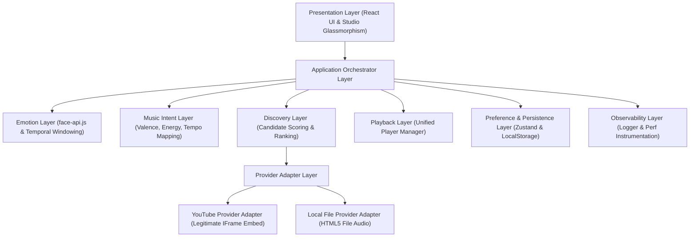

# MusicMirror — System Architecture & Design Specification (Stage 01)

## Executive Summary
MusicMirror is an autonomous, zero-cost to end-user, emotion-aware music discovery and playback application. It transforms real-time observable facial emotional signals into personalized, legally playable music recommendations without manual song searching, playlist creation, or subscription fees.

---

## 1. System Goals & Non-Goals

### System Goals
- **Zero Friction**: User grants camera permission, the system infers current observable emotional state, maps it to musical intent, discovers candidates, and starts playback automatically.
- **Zero Cost to End-User**: Rely strictly on client-side inference, open-source models, and zero-cost, legitimate music providers.
- **Provider-Agnostic Architecture**: Abstract music discovery and playback behind strict provider interfaces.
- **Probabilistic Emotion Inference**: Treat facial signals as probabilistic vectors with temporal window smoothing rather than single-frame truth.
- **Privacy & Security First**: Process all camera frames locally in browser memory. Never upload, record, or persist raw facial video data.

### Non-Goals
- **Eye Control / Gaze Interaction**: Explicitly excluded from this version.
- **CD Spinning Animations & Gimmicks**: Excluded in favor of sleek, dark, music-centric studio glassmorphism.
- **Paid Infrastructure**: No paid cloud databases, paid AI inference APIs, or mandatory subscription fees.
- **Medical / Psychological Diagnostics**: Facial signals are used solely for musical mood intent mapping; never presented as diagnostic fact.

---

## 2. Architecture Diagram



---

## 3. Module Map

```
frontend/src/
├── architecture/
│   ├── types/
│   │   └── domain.ts                 # Clean domain contracts & typed interfaces
│   ├── layers/
│   │   ├── EmotionLayer.ts           # Temporal window smoothing & confidence vectoring
│   │   ├── MusicIntentLayer.ts        # Emotion + goal -> acoustic target mapping
│   │   ├── DiscoveryLayer.ts          # Multi-provider candidate ranking & scoring
│   │   ├── ProviderAdapterLayer/
│   │   │   ├── MusicProviderAdapter.ts # Abstract provider contract
│   │   │   ├── YouTubeProviderAdapter.ts # YouTube IFrame embed adapter
│   │   │   └── LocalProviderAdapter.ts   # Local filesystem audio adapter
│   │   ├── PlaybackLayer.ts           # Unified playback manager
│   │   └── ObservabilityLayer.ts      # Structured logger & performance markers
│   └── orchestrator/
│       └── ApplicationOrchestrator.ts # Central workflow pipeline orchestrator
```

---

## 4. Technology Choices & Rationale

| Layer | Chosen Technology | Rationale |
|---|---|---|
| **Core Framework** | React 19 + TypeScript 6 | Strict type safety, high component reusability, and modern hooks architecture. |
| **Build Tool** | Vite 8 + Rolldown | Ultra-fast HMR and low latency production bundles. |
| **State Management** | Zustand 5 | Minimal footprint, zero boilerplate, persistent store. |
| **Emotion Inference** | `face-api.js` (TinyFaceDetector) | Free, open-source, client-side WebGL acceleration, 0 cloud cost. |
| **Testing Engine** | Vitest 4 | Fast, native ESM unit test runner. |
| **Provider Embeds** | YouTube IFrame API (nocookie) | Zero cost, legitimate legal streaming without website scraping or DRM circumvention. |

---

## 5. Core Data Models

```typescript
export type EmotionLabel = 'happy' | 'sad' | 'angry' | 'neutral' | 'surprise' | 'fearful' | 'disgusted';

export interface EmotionState {
  rawEmotion: string;
  normalizedEmotion: EmotionLabel;
  confidence: number;
  valenceScore: number;
  energyScore: number;
  temporalStability: number;
  timestamp: number;
}

export interface MusicIntent {
  intentId: string;
  emotion: EmotionState;
  targetValence: number;
  targetEnergy: number;
  targetTempoBpm: number;
  priorityLanguages: string[];
  priorityGenres: string[];
  goalModifier: string;
  timestamp: number;
}

export interface MusicCandidate {
  id: string;
  title: string;
  artist: string;
  genre: string;
  language: string;
  audioFeatures: { valence: number; energy: number; bpm: number };
  providerId: string;
  playbackRef: string;
  recommendationScore: number;
  recommendationReason: string;
}
```

---

## 6. Security & Privacy Model
- **Local Frame Processing**: Camera video frames are processed exclusively inside client WebGL memory. No video or images are stored or transmitted.
- **Minimum Permissions**: Only requests `video` stream from `getUserMedia`.
- **Zero Exposed Secrets**: No hardcoded API keys or credentials.

---

## 7. Performance & Error Recovery Strategy
- **Asynchronous Execution**: Discovery and ML inference run non-blocking on animation frames.
- **Temporal Windowing**: 8-frame sliding window filters out single-frame classification spikes.
- **Graceful Fallbacks**: If camera access fails, system defaults to guest preference mode without crashing. If discovery fails, returns neutral fallback queue.

---

## 8. Next Stage Readiness (Stage 02-10)
Stage 01 foundation is complete, fully tested, and validated. All architectural contracts are in place for Stage 02 (Emotion Engine Deep Refinement & Multi-Provider Candidate Aggregation).
